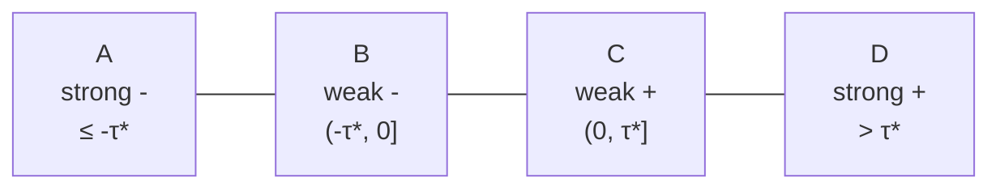
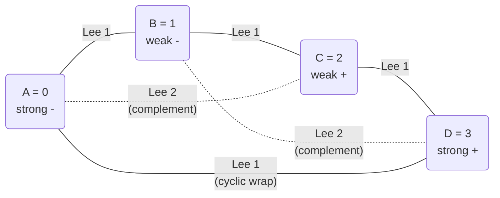
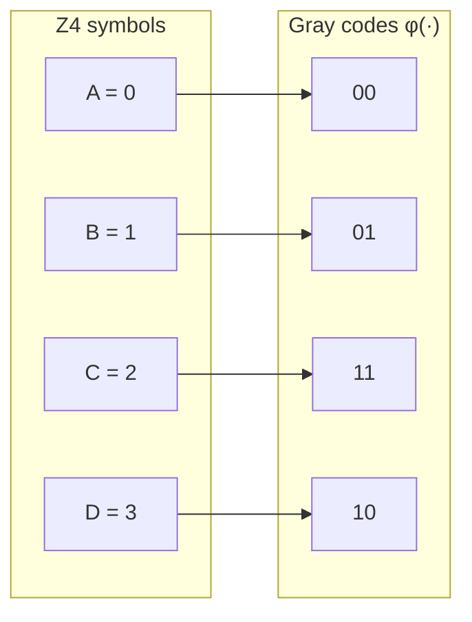
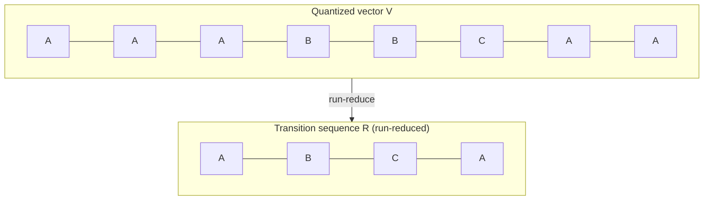

# Quaternary Quantization: Design

> **Related documents:** [PREDICTIONS.md](PREDICTIONS.md) · [TESTING.md](TESTING.md) · [RELATED_WORK.md](RELATED_WORK.md)

---

## Contents

1. [The Quantization Problem](#1-the-quantization-problem)
   - 1.1 [The quantization problem](#11-the-quantization-problem)
   - 1.2 [Concentration of measure](#12-concentration-of-measure)
   - 1.3 [The surface-area information bound](#13-the-surface-area-information-bound)
   - 1.4 [The L1 metric and the cross-polytope](#14-the-l1-metric-and-the-cross-polytope)
   - 1.5 [The quaternary coordinate](#15-the-quaternary-coordinate)
   - 1.6 [The quantization problem restated](#16-the-quantization-problem-restated)
2. [Quantization](#2-quantization)
   - 2.1 [The resource constraint](#21-the-resource-constraint)
   - 2.2 [Binary quantization](#22-binary-quantization)
   - 2.3 [Ternary quantization](#23-ternary-quantization)
   - 2.4 [Reconstruction vs. structural quantization](#24-reconstruction-vs-structural-quantization)
   - 2.5 [Quaternary quantization](#25-quaternary-quantization)
   - 2.6 [The Lee metric](#26-the-lee-metric)
   - 2.7 [The Gray map](#27-the-gray-map)
   - 2.8 [The complement involution](#28-the-complement-involution)
3. [The Transition Key](#3-the-transition-key)
   - 3.1 [Run-reduction](#31-run-reduction)
   - 3.2 [The 64-bit integer key](#32-the-64-bit-integer-key)
   - 3.3 [MSB alignment and prefix semantics](#33-msb-alignment-and-prefix-semantics)
   - 3.4 [Block file organisation](#34-block-file-organisation)
   - 3.5 [Window queries](#35-window-queries)
   - 3.6 [Bucket density](#36-bucket-density)
4. [The Combinatorial Structure](#4-the-combinatorial-structure)
   - 4.1 [The Geode factorization and hierarchical quantization](#41-the-geode-factorization-and-hierarchical-quantization)
   - 4.2 [Euler's polytope formula as a quantization constraint](#42-eulers-polytope-formula-as-a-quantization-constraint)
   - 4.3 [Mixed-precision quantization](#43-mixed-precision-quantization)
   - 4.4 [Analytical threshold geometry](#44-analytical-threshold-geometry)
   - 4.5 [Reconstruction and series reversion](#45-reconstruction-and-series-reversion)
5. [Application: Semantic Embeddings](#5-application-semantic-embeddings)
   - 5.1 [Embeddings and the unit hypersphere](#51-embeddings-and-the-unit-hypersphere)
   - 5.2 [Incommensurability](#52-incommensurability)
   - 5.3 [The thermal constraint](#53-the-thermal-constraint)
   - 5.4 [Relational geometry and the lingua franca](#54-relational-geometry-and-the-lingua-franca)

---

## 1 The Quantization Problem

### 1.1 The quantization problem

What is the natural discrete coordinate system for a continuous signal?

A point in $\mathbb{R}^n$ — or on the unit hypersphere $S^{n-1}$ — must be represented in a finite alphabet. The question is which alphabet, which metric, and which encoding preserve the structure that matters while discarding the structure that does not.

This question arises in many domains. Semantic embeddings are one important application (§5): a transformer model produces a vector on $S^{n-1}$ and the retrieval system must compress it to a discrete code. But the same geometric problem appears in model weight quantization, signal processing, sensor data encoding, and communication systems. In each case, a continuous measurement must be mapped to a small number of discrete levels, and the fidelity of that mapping is governed by the geometry of the space and the metric under which distances are measured.

The framework developed in this document is general. The quantization machinery — the four-cell decomposition, the Lee metric, the Gray map, the complement involution, the transition key — depends only on the L1 geometry of high-dimensional space, not on the source of the continuous signal. Application-specific considerations (the embedding coordinate frame, the thermal constraint of edge inference) are treated in §5.

---

### 1.2 Concentration of measure

The volume of the $n$-dimensional unit ball:

$$V_n(1) = \frac{\pi^{n/2}}{\Gamma\!\left(\tfrac{n}{2}+1\right)}$$

satisfies $V_n(1) \to 0$ as $n \to \infty$ (Stirling's approximation gives
$V_n(1) \sim \frac{1}{\sqrt{\pi n}}\left(\frac{2\pi e}{n}\right)^{n/2}$).

The fraction of the unit ball's volume contained in the outer shell of thickness
$\varepsilon$ is:

$$f_{\text{shell}}(n, \varepsilon) = 1 - (1-\varepsilon)^n$$

For any fixed $\varepsilon > 0$, $f_{\text{shell}} \to 1$ as $n \to \infty$. The shell
thickness required to capture fraction $f$ is:

$$\varepsilon^{\ast}(f, n) = 1 - (1-f)^{1/n} \approx \frac{-\ln(1-f)}{n}$$

| Fraction captured | Shell thickness |
|:-----------------:|:---------------:|
| 63.2% | $1/n$ |
| 86.5% | $2/n$ |
| 95.0% | $3/n$ |
| 99.0% | $4.61/n$ |

In 256 dimensions, 99% of the ball's volume lies within a shell of radial thickness
$4.61/256 \approx 0.018$.

For $u, v$ drawn uniformly from $S^{n-1}$:

$$\mathbb{E}[u \cdot v] = 0 \qquad \mathrm{Var}(u \cdot v) = \frac{1}{n}$$

The standard deviation of cosine similarity between two random unit vectors is $1/\sqrt{n}$.
At $n = 256$ this is $\approx 0.063$: the full range $[-1, +1]$ is compressed into
noise of order $\pm 0.06$. A trained model must push similar items closer than
this noise floor.

Each coordinate of a random unit vector satisfies:

$$\mathbb{E}[e_i] = 0 \qquad \mathbb{E}[e_i^2] = \frac{1}{n}$$

In high dimensions, the coordinates of a uniform random unit vector are approximately
i.i.d. $\mathcal{N}(0, 1/n)$.

---

### 1.3 The surface-area information bound

The shell thickness $\varepsilon^{*}(n) \sim c/n$ shrinks as $n$ grows. If the
space has a characteristic scale $L$, the absolute shell thickness is:

$$\delta(n) = \frac{c \cdot L}{n}$$

Setting $\delta(n_{\max}) = \ell_P$ (the Planck length,
$\approx 1.616 \times 10^{-35}$ m) gives:

$$n_{\max} = \frac{c \cdot L}{\ell_P}$$

Above $n_{\max}$, additional dimensions subdivide already-indistinguishable states.

The Bekenstein–Hawking bound states that the maximum entropy of a system enclosed by
area $A$ is $S_{\max} = A / (4\ell_P^2)$ — information scales with surface area, not
volume. The same structure follows from the geometry of high-dimensional spheres:

1. All volume concentrates at the surface as $n \to \infty$.
2. All distinguishable states live on $S^{n-1}$, not in the ball.
3. The capacity of the space is determined by how finely $S^{n-1}$ can be
   partitioned — a surface quantity.

The surface area of $S^{n-1}$ is $\mathcal{A}_{n-1}(1) = 2\pi^{n/2}/\Gamma(n/2)$.
The minimum distinguishable angular separation grows as $\sim 1/\sqrt{n}$, so the
marginal information per additional dimension decreases as the shell compresses.

The information content of a signal is encoded in which region of $S^{n-1}$ its representation occupies. The quantization problem is the problem of discretising that
surface efficiently.

The Euler polytope formula $V - E + F = \chi$ constrains the combinatorial capacity of any quantization lattice: the number of cells ($F$), boundaries ($E$), and vertices ($V$) are not independent. This is the combinatorial analog of the surface-area bound: just as the continuous information capacity is determined by the area of $S^{n-1}$, the discrete information capacity is determined by the topology of the quantization lattice (§4.2).

---

### 1.4 The L1 metric and the cross-polytope

The L2 distance couples all $n$ coordinates under a square root:

$$d_2(u, v) = \sqrt{\sum_{i=1}^n (u_i - v_i)^2}$$

The L1 metric decouples them:

$$d_1(u, v) = \sum_{i=1}^n |u_i - v_i|$$

The L1 unit ball is the cross-polytope:

$$B_1^n = \left\{ x \in \mathbb{R}^n : \sum_{i=1}^n |x_i| \leq 1 \right\}$$

In two dimensions this is the axis-aligned diamond with vertices at $(\pm 1, 0)$ and
$(0, \pm 1)$. Its boundary satisfies $|x_1| + |x_2| = 1$. The L1 "circle" has
$\pi_1 = 4$, which is exact and rational.

The $n$-dimensional cross-polytope has $2n$ vertices at $\pm e_i$ for each standard
basis vector, and $2^n$ facets. Each coordinate contributes an independent 1D
displacement; the total L1 distance is their sum. There is no coupling between
dimensions and no transcendental constant.

The axis-aligned Cartesian grid is the natural grid for the L1 ball: the diamond's
faces lie on the coordinate halfspaces, so the grid and the ball are aligned.

---

### 1.5 The quaternary coordinate

Under the L1 metric, $d_1(u, v)$ decomposes into $n$ independent scalar problems:
for each dimension $i$, how far apart are $u_i$ and $v_i$? The full distance is their
sum.

A single coordinate $x_i \in \mathbb{R}$ has two structural features relevant to
position on the L1 unit ball: its **sign** (which side of the origin) and its
**magnitude class** (near the origin or far from it). These two binary features yield
four cells. Fewer cells collapse one feature; more cells subdivide within a cell,
encoding intra-cell position that does not contribute to the L1 distance between
cells. Four is the minimum that preserves both features.

The four cells map to $\{A, B, C, D\} \leftrightarrow \{0, 1, 2, 3\}$ in
$\mathbb{Z}_4$. The Lee metric on $\mathbb{Z}_4$:

$$d_L(u_i, v_i) = \min(|u_i - v_i|,\ 4 - |u_i - v_i|)$$

is the L1 distance on the 4-point cycle. The cyclic wrap $d_L(D, A) = 1$ reflects
that strong-negative and strong-positive are both extreme vertices of the same axis,
adjacent in the L1 cross-polytope.

Extended to vectors:

$$d_L(u, v) = \sum_{i=1}^{n} \min(|u_i - v_i|,\ 4 - |u_i - v_i|)$$

The Gray map (§2.7) makes this computable by `popcnt(XOR)` on 64-byte vectors
without symbol decoding.

**A continuous measurement** is not the ground truth that the quaternary symbol
approximates. It is an overcomplete representation of an ordinal position. The bits
encoding intra-cell displacement contribute to the L2 norm and to shell concentration
(§1.2); they are not recoverable signal for L1 retrieval. The quantization discards
them.

---

### 1.6 The quantization problem restated

The question is not: how many bits per dimension approximate angular distance on $S^{n-1}$? The question is: what is the natural discrete coordinate system of the L1 unit ball? The answer — four cells per dimension — is derived in §2.5.

This question applies to any domain where continuous signals must be discretized under resource constraints: semantic embeddings, model weight compression, signal quantization, and sensor encoding all face the same geometric problem.

---
## 2 Quantization

### 2.1 The resource constraint

Quantization operates under a resource budget. The question is: given fixed compute, memory, or energy, what is the highest-fidelity discrete representation?

The resource constraint applies equally to edge inference (thermal), communication channels (bandwidth), and storage systems (capacity). In each case, the number of distinguishable levels per dimension is bounded by the available budget.

**The thermal constraint as a concrete instance.** Running a large language model on a consumer device operates near the thermal ceiling
of that hardware. A second dedicated embedding model, run in parallel or in sequence,
would exceed the thermal budget, cause throttling, and drain the battery. The constraint is therefore: given that an LLM is already running and already producing
activations, what is the highest-quality index constructible from those
activations alone, at a fixed and predictable compute cost? This thermal instance is developed further in the embedding application (§5.3).

---

### 2.2 Binary quantization

The simplest compression of a float32 activation $v_i$ is the sign bit:

$$q_{\text{bin}}(v_i) = \begin{cases} 0 & v_i \leq 0 \\ 1 & v_i > 0 \end{cases}$$

This produces one bit per dimension. The natural distance on the result is Hamming
distance.

**What is lost.** Float32 encodes both direction (sign) and magnitude. Binary
quantization discards magnitude entirely: $v_i = 0.01$ and $v_i = 4.7$ are
indistinguishable. For activations drawn from $\mathcal{N}(0, \sigma^{2})$:

$$I(v_i;\ q_{\text{bin}}(v_i)) = H(q_{\text{bin}}(v_i)) = 1 \text{ bit}$$

The magnitude information — which for transformer activations is
substantial — is absent from the index.

---

### 2.3 Ternary quantization

Ternary quantization adds a central state:

$$q_{\text{tern}}(v_i) = \begin{cases} - & v_i \leq -\tau \\ 0 & -\tau < v_i \leq \tau \\ + & v_i > \tau \end{cases}$$

This recovers one additional bit: whether the activation is near the boundary or
committed. For $\tau$ chosen to make the three states equiprobable:

$$I(v_i;\ q_{\text{tern}}(v_i)) = \log_2 3 \approx 1.585 \text{ bits}$$

**What remains lost.** The ternary alphabet $\{-, 0, +\}$ has group structure
$\mathbb{Z}_3$, which admits no fixed-point-free involution — there is no map
$\theta: \mathbb{Z}_3 \to \mathbb{Z}_3$ satisfying $\theta^2 = \text{id}$ and
$\theta(x) \neq x$ for all $x$. The complement relationship between a value and its
structural opposite — present in the signal space as the relationship between
strong-positive and strong-negative directions — is not representable.

---

### 2.4 Reconstruction vs. structural quantization

Standard 4-bit quantization for LLM weight compression (GPTQ, AWQ, and related
methods) assigns 4 bits per parameter using a learned or analytical codebook that
minimises reconstruction error:

$$\min_{\hat{W}} \| W - \hat{W} \|_F^2$$

subject to $\hat{W}$ having 4-bit entries ($2^4 = 16$ levels per dimension).

This is **reconstruction quantization**: the objective is to minimize $\|W - \hat{W}\|_F^2$, approximating the original signal as closely as possible. **Structural quantization** (the subject of this document) has a different objective: preserve relational and topological structure — distances, trajectories, and complement relationships — rather than pointwise values. The two objectives share the quaternary alphabet but differ in metric, distribution, and purpose.

A survey of overlapping work — including BQQ (NeurIPS 2025), QUAD, QuES, BitNet, and domain-specific applications — is in [RELATED_WORK.md](RELATED_WORK.md).

---

### 2.5 Quaternary quantization

The preceding analysis identifies what a correct scheme requires:

1. **Sign** — which side of the decision hyperplane.
2. **Magnitude class** — near the boundary or strongly committed.
3. **Complement structure** — a fixed-point-free involution $\theta$ satisfying
   $\theta^2 = \text{id}$ and $\theta(x) \neq x$ for all $x$.
4. **Minimum alphabet** — the fewest symbols satisfying all three requirements.

Requirements 1 and 2 together demand at least four states. Requirement 3 demands a
complement involution. Requirement 4 asks whether three states suffice: with
$\{-, 0, +\}$, the only candidate involution swaps $-$ and $+$, leaving $0$ with no
valid image. Four is the minimum.

**The four states** are labelled by signed magnitude class:

$$\{A,\ B,\ C,\ D\} \;\longleftrightarrow\; \{\text{strong-},\ \text{weak-},\ \text{weak+},\ \text{strong+}\}$$

**The quantization threshold.** For activations drawn from $\mathcal{N}(0, 1/n_s)$
where $n_s$ is the embedding dimension[^1], the maximum-entropy condition requires
equiprobable states:

$$P(v_i \leq -\tau^{\ast}) = P(-\tau^{\ast} < v_i \leq 0) = P(0 < v_i \leq \tau^{\ast}) = P(v_i > \tau^{\ast}) = \tfrac{1}{4}$$

The threshold is:

$$\tau^{\ast} = \frac{\Phi^{-1}(3/4)}{\sqrt{n_s}} \approx \frac{0.6745}{\sqrt{n_s}}$$

**The quantization function:**

$$q(v_i) = \begin{cases} A & v_i \leq -\tau^{\ast} \\ B & -\tau^{\ast} < v_i \leq 0 \\ C & 0 < v_i \leq \tau^{\ast} \\ D & v_i > \tau^{\ast} \end{cases}$$

The four equiprobable zones on the real line, separated by $-\tau^{\ast}$, $0$, and $+\tau^{\ast}$:



**Empirical calibration.** In practice $\tau^{\ast}$ is estimated from a reservoir sample
of 1 024 sample activations per compaction cycle, using the empirical 25th and 75th
percentiles of $v_i$ to keep the symbol distribution close to equiprobable without
assuming a specific activation shape.

**Analytical threshold computation.** For source distributions expressible as polynomial or mixture models, the equiprobable threshold $\tau^{\ast}$ can be computed analytically via the hyper-Catalan series (Wildberger & Rubine 2025; the formal development is in §4.4). The threshold equation $F(\tau) = k/4$ for CDF $F$ becomes a polynomial in the distribution parameters, and the threshold solution $\alpha = \sum_\mathbf{m} C_\mathbf{m} \cdot t_2^{m_2} t_3^{m_3} \cdots$ converges without iteration. Truncation order trades precision for compute cost — a natural fit for the resource-constrained setting of §2.1. This does not replace empirical calibration; it provides a second path when a parametric model of the source distribution is available.

Under the equiprobable target, each dimension carries:

$$I(v_i;\ q(v_i)) = \log_2 4 = 2 \text{ bits}$$

**Lee distances between the four states:**

| Pair | Lee distance |
|:----:|:------------:|
| $A$–$A$, $B$–$B$, $C$–$C$, $D$–$D$ | 0 |
| $A$–$B$, $B$–$C$, $C$–$D$ | 1 |
| $D$–$A$ (cyclic wrap) | 1 |
| $A$–$C$, $B$–$D$ (complements) | 2 |

---

### 2.6 The Lee metric

Given four ordered states $\{A=0,\ B=1,\ C=2,\ D=3\}$ arranged cyclically in
$\mathbb{Z}_4$, the Lee distance is:

$$d_L(u, v) = \min(|u - v|,\ 4 - |u - v|)$$

**Why this metric matches structural distance.** A weak-negative and a weak-positive
activation ($B$–$C$) are adjacent states: the coordinate was weakly committed in both cases, with opposite sign. Lee distance 1 reflects this. The complement pairs
$A$–$C$ and $B$–$D$ represent structural opposition: one signal activates a dimension
strongly in one direction, the other in the complementary direction. Lee distance 2
reflects this. Strong-negative and strong-positive ($A$–$D$) share strong commitment
to their respective directions; the cyclic metric assigns them distance 1, not 2.

Hamming distance on raw 2-bit strings does not capture the cyclic structure; it
assigns $A$–$D$ (encodings `00` and `10`) distance 1 correctly, but $A$–$C$
(encodings `00` and `11`) distance 2 for the wrong reason (both bits flip, not
because of complement structure).

**Example.** For two 4-dimensional vectors:

$$u = [A, B, C, D] = [0, 1, 2, 3]$$
$$v = [A, C, C, B] = [0, 2, 2, 1]$$

Position-wise: $d_L(0,0)=0$, $d_L(1,2)=1$, $d_L(2,2)=0$, $d_L(3,1)=\min(2,2)=2$.
Total: $d_L(u,v) = 3$.

For $n = 256$ dimensions the maximum Lee distance is $256 \times 2 = 512$.

The four symbols arranged on the $\mathbb{Z}_4$ cycle, with Lee distances annotated:



---

### 2.7 The Gray map

The Gray map $\phi: \mathbb{Z}_4 \to \{0,1\}^2$ is the unique binary encoding that
makes Hamming distance on the encoded vectors equal to Lee distance on the originals:

$$\phi(0) = \mathtt{00} \qquad \phi(1) = \mathtt{01} \qquad \phi(2) = \mathtt{11} \qquad \phi(3) = \mathtt{10}$$

**Theorem 2.1** *(Hammons, Kumar, Calderbank, Sloane, Solé, 1994).* $\phi$ is an
isometry from $(\mathbb{Z}_4^n, d_L)$ to $(\{0,1\}^{2n}, d_H)$:

$$d_H(\phi(u), \phi(v)) = d_L(u, v) \quad \text{for all } u, v \in \mathbb{Z}_4^n$$

**Proof of the single-symbol case.**

| Pair | Encodings | XOR | Hamming | Lee |
|:----:|:---------:|:---:|:-------:|:---:|
| $(0,0),(1,1),(2,2),(3,3)$ | equal | `00` | 0 | 0 |
| $(0,1),(1,2),(2,3)$ | adjacent | `01` or `10` | 1 | 1 |
| $(0,3)$ | cyclic wrap | `10` | 1 | $\min(3,1)=1$ |
| $(0,2),(1,3)$ | complement | `11` | 2 | $\min(2,2)=2$ |

Hamming equals Lee in every case. The extension to vectors follows by summing over
positions. $\square$

**Consequence.** `popcnt(XOR)` on Gray-encoded vectors computes the exact cyclic Lee
distance without any symbol-level decoding. This is the fastest hardware-accelerated
distance primitive available.

**Closed form.** For $n \in \{0,1,2,3\}$:

$$\phi(n) = n \oplus (n \gg 1)$$

This allows computing Gray codes for four symbols simultaneously in one SIMD XOR
instruction.

**The encoding table:**

| Symbol | Meaning | $\mathbb{Z}_4$ | $\phi$ |
|:------:|:-------:|:--------------:|:------:|
| $A$ | Strong negative | 0 | `00` |
| $B$ | Weak negative | 1 | `01` |
| $C$ | Weak positive | 2 | `11` |
| $D$ | Strong positive | 3 | `10` |

A 256-dimensional embedding encodes to $256 \times 2 = 512$ bits = 64 bytes.

**As a bitmask.** Each 2-bit Gray code is a bitmask over two independent binary features of the quantized coordinate. The **high bit** (MSB of $\phi$) encodes **sign**: $0$ for negative ($A$, $B$) and $1$ for positive ($C$, $D$). The **low bit** (LSB of $\phi$) encodes **magnitude class**: $0$ for strong commitment ($A$, $D$) and $1$ for near-boundary ($B$, $C$). Because the two bits are independent, `XOR` measures disagreement in each feature separately — which is exactly why `popcnt(XOR)` computes Lee distance without any symbol decoding.

The Gray map ensures `popcnt(XOR)` on the 2-bit codes equals Lee distance — no symbol decoding needed:



`popcnt(XOR)` on the Gray-encoded vectors gives the exact Lee distance.

---

### 2.8 The complement involution

Define $\theta: \mathbb{Z}_4 \to \mathbb{Z}_4$ by:

$$\theta(x) = x + 2 \pmod{4}$$

This gives $\theta(A)=C$, $\theta(B)=D$, $\theta(C)=A$, $\theta(D)=B$.

In the $\phi$-encoding, $\theta$ is bitwise NOT: $\phi(\theta(x)) = \overline{\phi(x)}$.

**Proposition 2.2** *(Universal complement identity).* For any vector
$v \in \mathbb{Z}_4^{256}$ and its complement $\bar{v}$ defined componentwise by $\theta$:

$$\phi(v) \oplus \phi(\bar{v}) = \underbrace{\mathtt{FF}\ldots\mathtt{FF}}_{64 \text{ bytes}}$$

*Proof.* For any 2-bit Gray encoding $e$, $e \oplus \bar{e} = \mathtt{11}$ by
bitwise NOT. All 256 positions contribute `11`; concatenated over 512 bits the result
is all-ones. $\square$

**Corollary 2.3** *(Self-complement exclusion).* No vector $v$ satisfies $v = \bar{v}$.

*Proof.* If $v = \bar{v}$ then $\phi(v) \oplus \phi(\bar{v}) = 0 \neq \mathtt{FF}\ldots\mathtt{FF}$. $\square$

---

## 3 The Transition Key

### 3.1 Run-reduction

Given a quantized vector $V = (v_0, v_1, \ldots, v_{n-1}) \in \{0,1,2,3\}^n$,
**run-reduction** produces a transition sequence by a single left-to-right pass:

```
R <- (v[0])
for i in 1..n-1:
    if v[i] != v[i-1]: append v[i] to R
```

The result $R = (r_0, r_1, \ldots, r_{k-1})$ is the sequence of distinct consecutive
values of $V$: every run of identical adjacent symbols is collapsed to its first
element.

**Lemma 3.1** *(Idempotence).* $\text{reduce}(\text{reduce}(V)) = \text{reduce}(V)$.

*Proof.* In $R = \text{reduce}(V)$, adjacent elements are always distinct by
construction. The second pass therefore appends every element of $R$, returning $R$
unchanged. $\square$

**Lemma 3.2** *(Length bound).* $|R| \leq |V|$, with equality iff $V$ is already a
transition sequence.

*Proof.* Each element of $V$ contributes at most one element to $R$. $\square$

**Lemma 3.3** *(Run-length invariance).* Two vectors $V$ and $V'$ with the same
transition sequence but different run lengths map to the same $R$.

*Proof.* Run-reduction discards run-length information. $\square$

Run-length invariance means a signal that visits a quantization state once and a
signal that dwells in it for many consecutive dimensions share the same key. The key
records which states were visited, not how long each visit lasted.

**Example of run-reduction:**



Repeated runs of the same symbol collapse to one; only transitions are kept.

---

### 3.2 The 64-bit integer key

Given $R = (r_0, r_1, \ldots, r_{k-1})$ with $r_i \in \{0,1,2,3\}$, the integer key
$K$ is the base-4 number with $R$ as its digits, most significant first:

$$K(R) = \sum_{i=0}^{\min(k,32)-1} r_i \cdot 4^{31-i}$$

**Theorem 3.4** *(Exact 64-bit fit).* The range of $K$ is $[0,\ 2^{64}-1]$.

*Proof.* The maximum 32-digit base-4 number is:

$$K_{\max} = \sum_{i=0}^{31} 3 \cdot 4^i = 3 \cdot \frac{4^{32}-1}{3} = 4^{32} - 1$$

Since $4 = 2^2$, we have $4^{32} = 2^{64}$, so $K_{\max} = 2^{64} - 1$. The minimum
is 0. No overflow, no wasted bit. $\square$

**Corollary 3.5** *(Bit layout).* Bits 63–62 encode $r_0$; bits 61–60 encode $r_1$;
bits 1–0 encode $r_{31}$.

**Sequences longer than 32.** If $|R| > 32$, only the first 32 symbols enter the key.
Documents whose transition sequences agree in the first 32 steps and diverge only
afterward share a key and are retrieved as a group by any window query. Intra-bucket
distinction is resolved by the Lee-distance re-ranking step.

**64-bit key bit layout** (each symbol occupies 2 bits, MSB-first):

| b63–62 | b61–60 | b59–58 | b57–56 | b55–54 | b53–52 | … | b5–4 | b3–2 | b1–0 |
|:------:|:------:|:------:|:------:|:------:|:------:|:-:|:----:|:----:|:----:|
| $r_0$ | $r_1$ | $r_2$ | $r_3$ | $r_4$ | $r_5$ | … | $r_{29}$ | $r_{30}$ | $r_{31}$ (LSB) |

---

### 3.3 MSB alignment and prefix semantics

The key is left-aligned: $r_0$ occupies the most significant two bits.

**Definition.** The *resolution depth* of a transition at position $i$ in $R$ is $i$.
Depth 0 is the first transition; depth 31 is the finest resolvable discrimination.

**Proposition 3.6** *(Prefix clustering).* Two keys $K_1$ and $K_2$ share a common
prefix of length $j$ if and only if their transition sequences agree in positions
$0$ through $j-1$.

*Proof.* The $j$ most significant base-4 digits of $K$ are exactly $r_0, \ldots,
r_{j-1}$. $\square$

**Corollary 3.7** *(Key distance bounds).* If $R_1$ and $R_2$ first diverge at
position $j$:

$$|K_1 - K_2| \leq 4^{32-j} - 1$$

A window of half-width $\delta = 4^{32-j}$ recovers all sequences that agree with the
query in the first $j$ transitions.

---

### 3.4 Block file organisation

The 64-bit key space $[0, 2^{64})$ is partitioned into 8 block files, each covering
$2^{61}$ consecutive keys.

**Partition.** Block $b \in \{0, \ldots, 7\}$ covers:

$$\mathcal{B}_b = \bigl[ b \cdot 2^{61},\ (b+1) \cdot 2^{61} \bigr)$$

The block index for a key $K$ is the top 3 bits: $b(K) = K \gg 61$.

| Block | Hex range |
|:-----:|:----------|
| 0 | `0x0000000000000000` – `0x1FFFFFFFFFFFFFFF` |
| 1 | `0x2000000000000000` – `0x3FFFFFFFFFFFFFFF` |
| 2 | `0x4000000000000000` – `0x5FFFFFFFFFFFFFFF` |
| 3 | `0x6000000000000000` – `0x7FFFFFFFFFFFFFFF` |
| 4 | `0x8000000000000000` – `0x9FFFFFFFFFFFFFFF` |
| 5 | `0xA000000000000000` – `0xBFFFFFFFFFFFFFFF` |
| 6 | `0xC000000000000000` – `0xDFFFFFFFFFFFFFFF` |
| 7 | `0xE000000000000000` – `0xFFFFFFFFFFFFFFFF` |

Within each block file, keys are stored sorted. A block file is a sorted sequence of
$(K, \text{doc\_id})$ pairs. Range queries reduce to a binary-search lower bound
followed by a sequential scan to the upper bound.

**Block count.** $N_b = 8$ balances two constraints:

- *Density:* each file must contain enough entries ($C/N_b$ on average) for binary
  search to be worthwhile.
- *Sparsity:* a window $[K-\delta, K+\delta]$ must select a small result set.
  Block size $2^{61}$ with $C \leq 10^{12}$ documents gives occupancy
  $\leq 10^{12}/2^{61} \approx 4 \times 10^{-7}$.

$N_b = 8 = 2^3$ keeps block routing to a 3-bit shift. Fewer blocks merge too many
concepts into one file; more blocks fragment the corpus into mostly-empty files.

---

### 3.5 Window queries

**Definition.** A *window query* with centre $K$ and half-width $\delta$ retrieves all
indexed entries with key in $[K-\delta,\ K+\delta]$:

$$W(K, \delta) = \{ (K',\ \text{doc\_id}) : |K' - K| \leq \delta \}$$

**Theorem 3.8** *(Two-file bound).* For any $K$:

1. If $\delta \leq 2^{60} - 1$, then $W(K, \delta)$ intersects at most 2 block files.
2. If $\delta < 2^{61}$, then $W(K, \delta)$ intersects at most 3 block files.

*Proof.* The interval $[K-\delta, K+\delta]$ has width $2\delta+1$. For (1),
we have $2\delta+1 \leq 2(2^{60}-1)+1 = 2^{61}-1 < 2^{61}$, so the interval can
straddle at most one block boundary and thus intersect at most 2 block files.
For (2), $\delta < 2^{61}$ implies $2\delta+1 < 2\cdot 2^{61} = 2^{62}$, so the
interval can straddle at most two block boundaries and thus intersect at most
3 block files. $\square$

Any practically chosen window satisfies $\delta < 2^{61}$ ($\approx 2.3\times10^{18}$);
a query spanning more than $10^{18}$ consecutive keys is a corpus scan, not a window
query.

**Interpretation of $\delta$.** Setting $\delta = 4^{32-j} - 1$ retrieves exactly
all documents whose transition sequences agree with the query in the first $j$
transitions (Corollary 3.7):

| Prefix length $j$ | Half-width $\delta$ | Interpretation |
|:-----------------:|:-------------------:|:---------------|
| 32 | 0 | Exact key match |
| 31 | 3 | First 31 transitions match |
| 30 | 15 | First 30 transitions match |
| 28 | 255 | First 28 transitions match |
| 24 | 65 535 | First 24 transitions match |
| 16 | $\approx 4.3 \times 10^9$ | First 16 transitions match |

---

### 3.6 Bucket density

Documents with identical transition sequences share the same key and occupy the same
bucket. This is the intended behaviour: co-located signals traversed the same
quantization path.

Let $D$ be the number of distinct transition sequences in a corpus of $C$ documents.
Mean bucket size is $C/D$.

**Address space sparsity.** Even if every document in human history
($\approx 10^{10}$ documents) produced a unique 32-step trajectory, the occupancy of
the 64-bit key space is:

$$\frac{10^{10}}{2^{64}} \approx 5 \times 10^{-10}$$

The space is sparse; windows land in a sparse sea and return small, coherent
neighbourhoods. The oft-cited claim that $2^{64}$ addresses every atom in the
observable universe overstates it by 16 orders of magnitude — the observable universe
contains $\approx 10^{80}$ atoms and $2^{64} \approx 10^{19}$ — but the sparsity
conclusion is correct regardless.

**Admissible sequence count.** The transition trie has a root of arity $q = 4$ and all subsequent nodes of arity $q - 1 = 3$ (each successor must differ from its predecessor). The number of distinct transition sequences of length $k$ is:

$$D(k) = q \cdot (q-1)^{k-1} = 4 \cdot 3^{k-1}$$

For $k = 32$ (the key capacity), $D(32) = 4 \cdot 3^{31} \approx 2.47 \times 10^{15}$, occupying $\approx 1.34 \times 10^{-4}$ of the $2^{64}$ address space. The no-repeat constraint eliminates $\approx 99.99\%$ of possible 64-bit keys, concentrating all valid transition sequences into a sparse subset.

The generating function for all transition sequences is $S(x) = (1 + x)/(1 - 3x)$, with the Geode factorization $S - 1 = S_1 \cdot G$ where $S_1 = 4x$ and $G = 1/(1 - 3x)$ (§4.1). This decomposition makes the information gain per additional symbol explicit: the first symbol contributes $\log_2 4 = 2$ bits; each subsequent symbol contributes $\log_2 3 \approx 1.585$ bits. A 32-symbol key carries $2 + 31 \times \log_2 3 \approx 51.1$ effective bits of information within its 64-bit container.

**Hyper-Catalan bucket density.** The expected bucket density is not uniform across the trie. The hyper-Catalan framework (§4.3) counts the number of structurally distinct subtrees at each branching node; when the source distribution is non-uniform (as it is for any trained model), certain subtrees attract disproportionate occupancy. The ratio of observed to expected bucket density at each trie node is a diagnostic of the source distribution's departure from uniformity, connecting the combinatorial structure of §4 to the empirical bucket statistics.

**Corollary 3.9** *(Non-trivial windows).* For any practical corpus, a window of
half-width $\delta = 4^{32-j} - 1$ with $j \leq 28$ returns a non-empty result only when
the query has neighbours that shared its first $j$ transitions. An empty result is
informative: no indexed document followed the same high-level path as the
query.

---

## 4 The Combinatorial Structure

### 4.1 The Geode factorization and hierarchical quantization

The central structural result of Wildberger & Rubine (2025) is the factorization:

$$S - 1 = S_1 \cdot G$$

where $S$ is the generating function for all structured codewords, $S_1$ is the generating function for the first quantization step (the coarsest level), and $G$ is the *Geode* — the generating function for everything after the first level has been decided.

In the language of quantization, this factorization describes **hierarchical quantization**: first decide the coarse cell, then refine within it. The Geode $G$ counts the refinement possibilities at each subsequent level.

For Q²'s transition key, the factorization is concrete. The generating function for all transition sequences of length $\geq 1$ is:

$$S(x) - 1 = \frac{4x}{1 - 3x} = \underbrace{4x}_{S_1} \cdot \underbrace{\frac{1}{1-3x}}_{G}$$

The first factor $S_1 = 4x$ records the first symbol $r_0$ (4 choices, selecting the block file). The Geode $G = 1/(1-3x) = 1 + 3x + 9x^2 + \cdots$ counts all possible continuations — the tail of the key after the first symbol is fixed.

| Level | Paper | Q² transition key | General quantization |
|:-----:|:------|:------------------|:--------------------|
| Full structure | $S$ | All transition sequences | All codewords |
| First level | $S_1$ | $r_0$ (first symbol → block file) | Coarse quantization cell |
| Refinement | $G$ | $K_{\text{tail}}$ (remaining key) | Sub-cell refinement |
| Recursion | $S = 1 + S_1 G$ | Key = prefix + tail | Hierarchical VQ |

The factorization is *recursive*: $G$ itself contains $S$, so the refinement at level 2 factors the same way. This is the algebraic version of a multi-resolution quantization scheme — coarse-to-fine, with the Geode counting the degrees of freedom at each level.

Window queries (§3.5) are already implicitly performing this hierarchical decomposition. A query with prefix length $j$ fixes the first $j$ symbols (the coarse structure) and retrieves all documents that refine those $j$ symbols in any way. The Geode factorization provides the theory behind why this works: the number of valid refinements at depth $j$ is exactly $3^{32-j}$, which is the coefficient structure of $G$.

---

### 4.2 Euler's polytope formula as a quantization constraint

The hyper-Catalan coefficient from Wildberger & Rubine (2025):

$$C_\mathbf{m} = \frac{(E-1)!}{(V-1)! \cdot \mathbf{m}!}$$

is governed by Euler's polytope formula $V - E + F = \chi$, where:

- $F$ = number of cells (the codewords of the quantization lattice),
- $E$ = number of cell boundaries (where the quantization function is discontinuous),
- $V$ = number of vertices (where three or more cells meet),
- $\chi$ = Euler characteristic of the underlying space.

Euler's formula constrains these quantities: you cannot have $F$ cells, $E$ boundaries, and $V$ vertices in arbitrary combination. The topology of the quantization lattice determines admissible $(V, E, F)$ triples.

For Q² specifically, the $\mathbb{Z}_4$ cycle has $V = 4$ vertices, $E = 4$ edges, and $F = 1$ face (the single outer region):

$$4 - 4 + 1 = 1 = \chi \quad \checkmark$$

For the product lattice $\mathbb{Z}_4^n$, the face structure scales with $n$ and its Euler characteristic is computable from the hyper-Catalan framework.

When extending to higher-order alphabets ($q = 8$, $q = 16$, etc.) or to non-cyclic topologies, Euler's formula provides an *a priori* constraint on what quantization lattice geometries are possible. Rather than searching over lattice designs, one enumerates the admissible $(V, E, F)$ triples and the hyper-Catalan coefficient tells how many distinct quantizations each topology supports.

---

### 4.3 Mixed-precision quantization

The Bi-Tri (and higher) hyper-Catalan arrays (Wildberger & Rubine 2025, Table 1) count structures with $m_2$ binary splits, $m_3$ ternary splits, and $m_4$ quaternary splits. In quantization terms:

- A **binary split** is a 1-bit quantization step (above/below threshold).
- A **ternary split** is a $\log_2 3 \approx 1.585$-bit step (below/near/above).
- A **quaternary split** is a 2-bit step (Q²'s $\{A, B, C, D\}$).

A general quantization framework may mix these: use 2-bit precision on high-variance dimensions and 1-bit on low-variance dimensions. The number of distinct mixed-precision codebooks with $m_2$ binary dimensions, $m_3$ ternary dimensions, and $m_4$ quaternary dimensions is:

$$C_{(m_2, m_3, m_4)} = \frac{(E-1)!}{(V-1)! \cdot m_2! \cdot m_3! \cdot m_4!}$$

This is a row of the hyper-Catalan array, directly from the paper.

**Concrete example.** Consider a 256-dimensional signal where variance analysis identifies 128 high-variance dimensions and 128 low-variance dimensions. Allocating 2 bits to the high-variance dimensions (quaternary, preserving sign and magnitude class) and 1 bit to the low-variance dimensions (binary, preserving sign only) yields a mixed-precision code of $128 \times 2 + 128 \times 1 = 384$ bits — a 25% reduction from the uniform quaternary code — with the hyper-Catalan framework bounding the number of structurally distinct such allocations.

---

### 4.4 Analytical threshold geometry

For non-Gaussian distributions — mixtures, heavy-tailed activations, quantized signal processing — the equiprobable threshold equation:

$$F(\tau) = \frac{k}{q}, \qquad k = 1, \ldots, q-1$$

for CDF $F$ becomes a polynomial in the distribution parameters. The hyper-Catalan series solves this combinatorially:

$$\alpha = \sum_\mathbf{m} C_\mathbf{m} \cdot t_2^{m_2} t_3^{m_3} \cdots$$

where each $C_\mathbf{m}$ is a hyper-Catalan number and $t_j$ are functions of the distribution parameters.

The series converges by direct evaluation — no Newton iteration, no gradient descent. On constrained hardware, a closed-form series that can be truncated to the precision affordable within the resource budget (§2.1) is preferable to an iterative solver that may not converge within budget. The truncation order itself is a resource-allocation decision: each additional term in the hyper-Catalan series refines the threshold, trading compute cost for quantization precision.

For the standard case ($q = 4$, Gaussian source), the series reduces to the known quartile $\tau^{\ast} = \Phi^{-1}(3/4)$. For mixture-of-Gaussians sources — the natural model for multi-modal activation distributions — the threshold is expressible as a hyper-Catalan series in the mixture weights.

---

### 4.5 Reconstruction and series reversion

If Q² requires a decode path — for lossy compression applications rather than retrieval — the optimal reconstruction point for symbol $s$ is:

$$\hat{x}(s) = \mathbb{E}[x \mid q(x) = s]$$

For non-uniform distributions, this is *not* the cell centroid; it is the conditional expectation within each quantization cell. Computing it for parametric distributions requires inverting the CDF within each cell, which is a series-reversion problem.

The hyper-Catalan series provides this inversion combinatorially, without numerical root-finding. Wildberger & Rubine (2025, §10) show that Lagrange inversion and the hyper-Catalan series are two faces of the same coin: the series coefficients that solve the forward threshold problem also yield the inverse.

This is noted as a future extension. The current Q² pipeline is retrieval-only (quantize, index, search); no reconstruction step is needed. Should a decode path become necessary — for example, in signal compression or approximate model distillation — the reconstruction formula is already provided by the series-reversion machinery.

---

## 5 Application: Semantic Embeddings

The framework of §1–§4 is general: it applies to any continuous signal that must be discretized under resource constraints. This section develops the primary application — semantic embeddings produced by transformer models — where the continuous signal is a point on the unit hypersphere and the resource constraint is the thermal budget of edge inference.

### 5.1 Embeddings and the unit hypersphere

A transformer model maps a document to a vector in $\mathbb{R}^n$ by passing its token
sequence through the network and L2-normalising the hidden-state activation at a
selected token position. The output is a point on the unit hypersphere:

$$e \in S^{n-1} = \left\{ x \in \mathbb{R}^n : \|x\| = 1 \right\}$$

Each coordinate satisfies $\sum_i e_i^2 = 1$. Semantic similarity between documents is
measured by cosine similarity, which equals the dot product between normalised vectors:

$$\text{sim}(u, v) = u \cdot v = \cos\theta_{uv}$$

where $\theta_{uv}$ is the angle between $u$ and $v$.

**Why not mean-pool?** Mean-pooling the token activations — computing
$\bar{h} = \frac{1}{T}\sum_{t=1}^{T} h_t$ where $h_t \in \mathbb{R}^n$ is the
hidden-state activation at position $t$ — produces, for unit-normalised token vectors
$h_t$, a vector inside the unit ball ($\|\bar{h}\| \leq 1$). When the document's tokens
activate semantically diverse directions, as any non-trivial document does, the
centroid is short because distinct directions cancel. The subsequent L2 renormalisation
stretches $\bar{h}$ back to $S^{n-1}$ by the factor $1/\|\bar{h}\|$. The components that
survive cancellation are those common to all token positions — model-specific bias and
positional structure — not the document's semantically distinctive content.
Mean-pooling as a dimensional-reduction technique therefore increases the noise and
lowers the signal.

---

### 5.2 Incommensurability

$S^{n-1}$ has no preferred orientation. Every rotation $Q \in O(n)$ is an isometry:

$$u \cdot v = (Qu) \cdot (Qv)$$

A model trained on a corpus places semantically similar documents near each other on
the sphere, but the absolute coordinate frame is determined by random initialisation
and training order. A second model trained on the same corpus produces an embedding
space related to the first by some unknown $Q \in O(n)$:

$$e_B(x) \approx Q \cdot e_A(x)$$

$Q$ is not available from the model weights and cannot be recovered without a large set
of paired examples and a Procrustes alignment solve.

For any two documents $x, y$ embedded by different models:

$$e_A(x) \cdot e_B(y)$$

depends entirely on $Q$. The dot product measures alignment between two arbitrary
coordinate frames, not semantic similarity between documents.

An untrained transformer also produces vectors on $S^{n-1}$, but with no training
signal to cluster similar documents, the geometry carries no semantic content. An
embedding is meaningful as a retrieval key only after training.

**Coordinate-frame incommensurability does not imply relational incommensurability.**
The rotation $Q$ scrambles absolute positions. It does not scramble differences.
For any documents $a, b, c, d$ satisfying $e_A(a) - e_A(b) + e_A(c) \approx e_A(d)$
in Model A's frame, the same relation holds in Model B's frame, because $Q$ distributes
linearly over vector arithmetic:

$$Q(e_A(a) - e_A(b) + e_A(c)) = e_B(a) - e_B(b) + e_B(c) \approx e_B(d)$$

Semantic analogies, concept offsets, and the parallelogram structure of the embedding
space are invariant under rotation. Incommensurability is a property of absolute
coordinates, not of semantic geometry. The implications are developed in §5.4.

---

### 5.3 The thermal constraint

The thermal constraint is the concrete instance of the general resource constraint (§2.1) specific to edge inference. Running a large language model on a consumer device operates near the thermal ceiling of that hardware. A second dedicated embedding model, run in parallel or in sequence, would exceed the thermal budget, cause throttling, and drain the battery. The constraint is therefore: given that an LLM is already running and already producing activations, what is the highest-quality semantic index constructible from those activations alone, at a fixed and predictable compute cost?

**Coordinate-frame incommensurability.** Quantization thresholds are calibrated from
one model's activation distribution. A different model produces different thresholds.
Quaternary codes in absolute terms are not comparable across models; an index must be
rebuilt when the model changes. The relational structure of the embedding space —
differences, analogies, topological trajectories — is preserved across models (§5.4),
but recovering it requires a Procrustes solve over paired examples, which is
thermally infeasible on constrained hardware.

**The thermal constraint and the geometric constraint coincide.** Cross-model
alignment requires a Procrustes solve over paired examples — geometrically necessary
but thermally impossible on constrained hardware. Using the LLM's own activations
satisfies both constraints simultaneously.

---

### 5.4 Relational geometry and the lingua franca

The rotation $Q$ is unknown and unrecoverable without paired supervision. Direct
cross-model coordinate comparison is therefore meaningless. But $Q$ acts uniformly
on the entire embedding space — it cannot selectively rotate some concepts while
leaving others fixed — so the *shape* of the space is preserved.

The canonical illustration: $\text{king} - \text{man} + \text{woman} \approx \text{queen}$. This
vector arithmetic works not because "king" lives at a special absolute address, but
because the training corpus encodes a consistent geometric offset between gendered
role-pair concepts. Both Model A and Model B, having trained on the same language,
construct the same parallelogram in their respective (rotated) frames. The analogical
relationship is not a coincidence of one model's random initialisation; it is a
property of the data.

The transition key (§3) exploits this directly. By recording the *sequence of
semantic directions visited* during inference — the topological trajectory through
the embedding space — rather than any absolute coordinate, it indexes shape rather
than position. Two models reading the same passage may produce entirely different
float32 vectors at each layer, yet execute the same sequence of semantic turns: the
same "hairpin" at the subordinate clause, the same "commitment" at the topic word.
The run-reduced key captures that shared structure without requiring knowledge of $Q$.

The generalized framework makes the lingua franca case stronger. The transition key captures relational structure that is invariant under rotation. This invariance is not an accident of the semantic embedding application — it is a consequence of the general framework: structural quantization (§2.4) preserves relational geometry by design. The embedding application is a special case where the rotation $Q$ corresponds to the arbitrary coordinate frame of a trained model.

Embeddings across models are not fully incommensurable. Their coordinate frames are;
their semantic geometry is not. The gap between those two facts is where Q² operates.

$$\underbrace{\text{king} - \text{man} + \text{woman}}_{\text{vector arithmetic on any model}} \approx \underbrace{\text{queen}}_{\text{same answer, rotated frame}}$$

The coordinate frames differ by $Q$. The parallelogram does not. Viewed from the
right angle, the incommensurability dissolves. 🤓

---

## References

- Hammons, A. R., Kumar, P. V., Calderbank, A. R., Sloane, N. J. A., & Solé, P. (1994). The $\mathbb{Z}_4$-linearity of Kerdock, Preparata, Goethals, and related codes. *IEEE Trans. Inform. Theory* 40:2, 301–319.
- Wildberger, N. J. & Rubine, D. (2025). A Hyper-Catalan Series Solution to Polynomial Equations, and the Geode. *Amer. Math. Monthly* 132:5, 383–402. DOI: 10.1080/00029890.2025.2460966

For references to overlapping work in the ML literature (BQQ, QUAD, QuES, BitNet, and related methods), see [RELATED_WORK.md](RELATED_WORK.md).

---

[^1]: The $1/n_s$ variance normalisation ensures the dot product of two random unit
vectors has bounded variance regardless of dimension. This is the same normalisation
used in transformer attention ($1/\sqrt{d_k}$).
