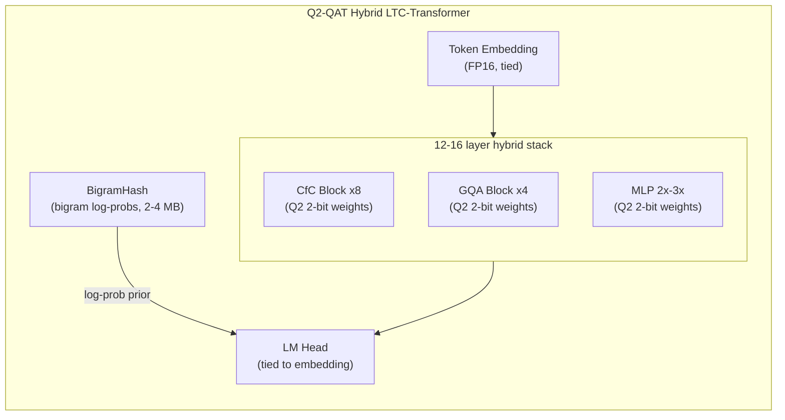

# Parameter Golf: A Q²-Based Strategy

> **Related documents:** [DESIGN.md](DESIGN.md) · [RELATED_WORK.md](RELATED_WORK.md)

Section references of the form §D-x.y refer to [DESIGN.md](DESIGN.md).
Section references of the form §R-x refer to [RELATED_WORK.md](RELATED_WORK.md).

---

## Contents

1. [The Challenge](#1-the-challenge)
2. [Current State of the Art](#2-current-state-of-the-art)
3. [The Q² Compression Advantage](#3-the-q-compression-advantage)
4. [Architecture: Liquid Time Constant Networks](#4-architecture-liquid-time-constant-networks)
5. [The Combined Strategy](#5-the-combined-strategy)
6. [Implementation Roadmap](#6-implementation-roadmap)
7. [Performance Projections](#7-performance-projections)
8. [References](#references)

---

## 1 The Challenge

OpenAI's **Parameter Golf** challenge (March–April 2026) asks participants to train
the language model that achieves the lowest bits-per-byte (bpb) on the FineWeb
validation set, subject to:

1. **Artifact size:** total compressed artifact (code + compressed model weights) ≤
   16,000,000 bytes (decimal 16 MB).
2. **Training time:** ≤ 10 minutes on 8×H100 SXM GPUs.
3. **Evaluation:** tokenizer-agnostic bpb on the first 50 000 FineWeb documents.

This is a form of *L(N)* optimisation in neural scaling-law notation — minimise
loss given a fixed parameter budget — unconstrained by data or total compute, but
tightly constrained by artifact size and training speed.

The challenge is inspired by NanoGPT Speedrunning (L(T) optimisation) and
NanoGPT Slowrun (L(D) optimisation). All three are special cases of the same
Pareto frontier: the scaling law surface $L(N, D, T)$.

---

## 2 Current State of the Art

The top leaderboard entries as of March 2026 use a consistent set of techniques:

| Run | bpb | Key techniques |
|:----|:---:|:---------------|
| 10L Int5-MLP + BigramHash(10240) | 1.1428 | Int5/Int6 mixed QAT, BigramHash, SWA 0.4, WD=0.04 |
| Int6 MLP3x + SmearGate + BigramHash | 1.1458 | Int6 QAT, 3x MLP, SmearGate, OrthoInit, SWA |
| 11L MLP3x + Int6 QAT | 1.1502 | 11 layers, 3x MLP, Int6 QAT, zstd-22, sliding eval |
| Naive Baseline | 1.2244 | 9 layers, 512 dim, 1024 vocab, tied embeddings |

The parameter budget for current SOTA entries is approximately:

$$N_{\text{SOTA}} \approx \frac{(B - C) \cdot 8}{b_{\text{eff}}}$$

where $B = 16 \times 10^6$ bytes is the total budget, $C \approx 50{,}000$ bytes
is the code footprint, and $b_{\text{eff}} \approx 5.5$ is the effective bits per
weight after int5/int6 packing and zstd-22 compression:

$$N_{\text{SOTA}} \approx \frac{(16{,}000{,}000 - 50{,}000) \times 8}{5.5} \approx 23 \text{ M parameters}$$

The BigramHash technique partitions the 16 MB budget between a vocabulary bigram
table (providing a strong unigram/bigram prior cheaply) and the neural model
(providing long-range context). The best entries use a vocabulary of 1024–10240
tokens; at 1024 tokens a complete bigram table costs $1024^2 \times 1 \approx 1$ MB,
leaving ~15 MB for the neural model.

**What the current SOTA does not do:**
- It does not use sub-5-bit structural quantization designed for maximum
  information preservation per bit (§D-2.4).
- It does not use recurrent or state-space architectures that provide sequential
  memory without O(n²) attention cost.
- It does not exploit the complement structure of the $\mathbb{Z}_4$ alphabet
  (§D-2.8) as an inductive bias for weight organisation.

---

## 3 The Q² Compression Advantage

### 3.1 Parameter capacity at 2 bits

Q² uses 2 bits per symbol, packing 4 symbols per byte. Applied to model weights
as a quantization-aware training (QAT) scheme — training with the quaternary
constraint from the start, as BitNet does with ternary weights (§R-3.1) — the
parameter capacity in 16 MB is:

$$N_{\text{Q}^2} \approx \frac{(B - C) \cdot 8}{2} \approx \frac{15{,}950{,}000 \times 8}{2} \approx 63.8 \text{ M parameters}$$

This is a **2.8× increase** in parameter count at the same artifact size, relative
to the current int5/int6 SOTA.

If the Q² weights compress by an additional factor of $r$ under zstd-22 (possible
when trained weights exhibit run-length structure that Q²'s Gray encoding exploits,
§D-2.7), the capacity grows further:

$$N_{\text{Q}^2,\, r} \approx 63.8 \cdot r \text{ M parameters}$$

For $r = 1.2$ (conservative 20% compression beyond raw 2-bit packing), the
effective capacity is ~76 M parameters.

### 3.2 Why structural quantization outperforms uniform grids at 2 bits

Standard int2 post-training quantization (GPTQ/AWQ at 2 bits) loses substantially
more accuracy than int4 because the reconstruction objective:

$$\min_{\hat{W}} \| W - \hat{W} \|_F^2$$

tries to approximate float32 weights with 4 levels, and the quantization error at
2 bits is large enough to disrupt learned representations.

Q² structural quantization has a different objective: preserve the *relational
geometry* of the weight space, not the pointwise values. The four cells
$\{A, B, C, D\}$ encode **sign** and **magnitude class**, which are the two
structural features that determine a weight's contribution to the L1 geometry of
activation space (§D-1.5). A weight quantized to $A$ (strong negative) and one
quantized to $C$ (weak positive) are separated by Lee distance 2 — the complement
distance — reflecting a fundamental opposition in their role, not an accident of
the numerical grid.

This matters for QAT because:

1. **Complement involution as a regulariser.** The constraint $\theta(W_{ij}) \neq W_{ij}$
   for all weights (§D-2.8) prevents the model from learning redundant weight pairs
   where $W_{ij}$ and $W_{kl}$ encode the same functional direction. It enforces
   orthogonality of the weight organisation at the symbolic level.

2. **Lee metric loss.** Training with a Lee distance penalty on weight changes
   encourages the model to make transitions that preserve complement structure.
   Gradient steps that would move $A \to C$ (complement flip, Lee distance 2) are
   penalised more than steps that move $A \to B$ (adjacent, Lee distance 1).

3. **Gray encoding preserves gradient flow.** The Gray map $\phi$ (§D-2.7) makes
   Hamming distance on the encoded bits equal to Lee distance on the symbols.
   The straight-through estimator (STE) for Q²-QAT propagates gradients through
   the Gray encoding as if the quantization were a smooth threshold operation,
   and the bit-level gradient is correctly ordered: a gradient pointing from $A$
   toward $D$ passes through $B$ and $C$ in order, not by a shortcut.

### 3.3 Expected compression benefit

The Gray-encoded weight tensor of a Q²-trained model has a specific statistical
structure. After training, the equiprobable condition (§D-2.5):

$$P(W_{ij} = A) = P(W_{ij} = B) = P(W_{ij} = C) = P(W_{ij} = D) = \tfrac{1}{4}$$

is the maximum-entropy condition: all four symbols are equally likely, so the raw
2-bit stream is nearly incompressible. The compression ratio $r \approx 1.0$ in
this limit.

**However**, trained networks organise their weights into structured patterns:
attention heads form near-orthonormal pairs, MLP neurons often have complementary
partners, and weight matrices develop block structure. The Q² run-reduction step
applied to weight rows (§D-3.1) can be used diagnostically to measure this
structure: a low transition density (many consecutive identical symbols) implies
longer runs and higher compressibility.

The empirical prediction is that Q²-QAT weights will compress to $r \approx 1.1$–$1.3$
under zstd-22 — more than a random 2-bit stream but less than the int5/int6 models
(which have float-shaped distributions amenable to entropy coding).

---

## 4 Architecture: Liquid Time Constant Networks

### 4.1 The parameter inefficiency of attention

Standard transformer attention has quadratic time complexity $O(n^2 d)$ in sequence
length and requires four weight matrices of size $d \times d$ per head per layer.
For a model with hidden dimension $d$ and $L$ layers:

$$N_{\text{attn}} = 4 L d^2$$

In the Parameter Golf setting, attention is expensive: each attention layer in a
512-dim model costs $4 \times 512^2 = 1.05 \text{ M}$ parameters, and the
information content is dominated by the key-value store, not the query-key
interaction.

For short-context tasks (1024–2048 tokens, as used in current winning entries), the
attention mechanism is also overqualified: most of the model's context budget is
already consumed by the first $\sim$10 positions, and positions beyond that
contribute diminishing marginal information.

### 4.2 Closed-form Continuous-time (CfC) layers

Hasani et al.'s **Closed-form Continuous-time** (CfC) networks provide a
parameter-efficient alternative. The CfC layer solves the Liquid Time Constant
(LTC) ODE:

$$\dot{h}(t) = -\left[\frac{1}{\tau} + f(h(t), x(t); \theta)\right] h(t) + f(h(t), x(t); \theta)$$

analytically, yielding a closed-form update:

$$h(t + \Delta t) = \sigma\!\left(-A_1(t) \cdot \Delta t\right) \odot h(t) + \frac{A_2(t)}{A_1(t)} \cdot \left[1 - \sigma\!\left(-A_1(t) \cdot \Delta t\right)\right]$$

where $A_1, A_2$ are functions of the input $x(t)$ and current state $h(t)$, and
$\sigma$ is the sigmoid function. This closed form:

1. Eliminates the numerical integration loop of vanilla LTC networks.
2. Provides causal, single-pass inference: each token updates the state $h$ in
   $O(d)$ time, independent of sequence length.
3. Requires only two linear projections ($A_1, A_2$) plus the state update — far
   fewer parameters than a full attention block.

**Parameter count comparison.** For hidden dimension $d$:

| Block type | Parameters per layer |
|:-----------|:--------------------:|
| Full MHA | $4d^2$ |
| GQA (4 KV heads) | $\approx 3.5 d^2$ |
| CfC (closed-form) | $\approx 2 d^2 + 2d$ |
| CfC (compact) | $\approx d^2 + 2d$ |

The CfC layer requires approximately $d^2$ fewer parameters per layer than
full attention. Over $L$ layers, this frees:

$$\Delta N = L \cdot d^2 \text{ parameters}$$

For $L = 10$, $d = 512$: $\Delta N = 10 \times 512^2 = 2.6 \text{ M}$ parameters
freed for other components (larger MLP, larger BigramHash table, or more layers).

### 4.3 Liquid Foundation Models (LFM 2.5) as a template

Liquid AI's **LFM 2.5** model demonstrates the viability of hybrid recurrent +
attention architectures at production scale. The LFM 2.5 architecture uses:

- **10 LIV (Liquid Integrated Vision/Language) Convolution Blocks:** CfC-based
  sequential processors that provide O(1) per-token memory through recurrent state.
- **6 GQA (Grouped Query Attention) Blocks:** Standard attention for positional
  cross-token mixing.
- **32k token trained context:** Achievable because LIV blocks handle most of the
  context without O(n²) cost.

The LFM 2.5 result demonstrates that attention is not required for most of the
model's depth — the CfC state provides sufficient long-range memory. Attention
is used selectively for in-context reasoning and positional disambiguation.

For the Parameter Golf setting, the 32k context is not needed. But the principle
transfers: **replace most attention layers with CfC, keep a few GQA layers for
in-context mixing.**

### 4.4 CfC layers and Q²-QAT synergy

The Q² structural quantization (§D-2.4) is particularly well-suited to CfC weights
for two reasons:

1. **State update weights have complement structure.** The two matrices $A_1$ and
   $A_2$ in the CfC update equation have a natural complement relationship: one
   controls the decay rate and the other controls the input integration rate.
   The Q² complement involution $\theta(A) = C$, $\theta(B) = D$ (§D-2.8) encodes
   this opposition directly — strong-decay and strong-integration are complements
   in the same way that strong-negative and strong-positive activations are.

2. **Fewer weights need high precision.** CfC state updates involve sigmoid
   activations, which saturate at $\pm 1$. Near the saturation region, the exact
   weight value matters less than its sign and magnitude class — precisely what Q²
   preserves (§D-1.5). The two cells $A$ (strong negative, below $-\tau^{\ast}$)
   and $D$ (strong positive, above $+\tau^{\ast}$) correspond to the saturation
   regime; $B$ and $C$ correspond to the linear-response regime near zero.

---

## 5 The Combined Strategy

### 5.1 Architecture

The proposed architecture for the Parameter Golf submission is a **Q²-QAT hybrid
LTC-Transformer**, combining:

1. **Q² 2-bit QAT** for all weight matrices (attention, MLP, CfC state).
2. **Hybrid depth:** alternating CfC recurrent blocks and GQA attention blocks,
   following the LFM 2.5 ratio of ~10:6 (recurrent to attention).
3. **BigramHash** vocabulary embedding: a hash table of bigram statistics stored
   as part of the 16 MB artifact.
4. **Sliding window evaluation** at stride 64.



**Hidden dimension and layer count.** With 64 M parameters at 2 bits per weight,
packed 4 per byte, and BigramHash(10240) consuming ~4 MB:

$$N_{\text{model}} \approx \frac{(16 \times 10^6 - 4 \times 10^6 - 50{,}000) \times 4 \times 8}{8} \approx 48 \text{ M effective parameters}$$

At hidden dimension $d = 768$, 16 layers (10 CfC + 6 GQA), MLP ratio 2×:

$$N \approx 16 \times (d^2 + 2d^2) + 6 \times 4d^2 = 16 \times 3 \times 768^2 + 6 \times 4 \times 768^2 \approx 49 \text{ M}$$

This comfortably fits the budget. Tuning $d$ to 800–960 and adjusting the
CfC/GQA ratio provides a parameter dial within the 16 MB constraint.

### 5.2 Quantization scheme

All linear weight matrices $W \in \mathbb{R}^{m \times n}$ are quantized to Q²
symbols $\{A, B, C, D\} = \{0, 1, 2, 3\} \subset \mathbb{Z}_4$. The quantization
threshold applied during training:

$$\tau^{\ast} = \frac{\Phi^{-1}(3/4)}{\sqrt{n}} \approx \frac{0.6745}{\sqrt{n}}$$

is computed from the current batch statistics (the empirical 25th and 75th
percentile of each row) and updated every 1024 training steps — the same
reservoir-calibration strategy described in §D-2.5 for activation quantization.

The straight-through estimator (STE) propagates gradients through the
quantization step:

$$\frac{\partial \mathcal{L}}{\partial W_{ij}} \approx \frac{\partial \mathcal{L}}{\partial \hat{W}_{ij}} \cdot \mathbf{1}\!\left[|W_{ij}| \leq \kappa\right]$$

where the passthrough window $\kappa$ is set to exclude extreme outliers that
would otherwise receive large gradients through the saturating threshold.

**Packed storage.** Q² symbols are Gray-encoded (§D-2.7) and packed 4 per byte
using the same packing scheme as the WebAssembly kernel in `src/q2.wat`:

```
byte = (g[4i] << 6) | (g[4i+1] << 4) | (g[4i+2] << 2) | g[4i+3]
```

This layout is identical to the activation quantization in `src/q2.wat`, making
the q2.ts library directly usable for weight packing at checkpoint export time.

### 5.3 Mixed-precision allocation

Not all weight matrices benefit equally from 2-bit precision. Following the
Geode mixed-precision framework (§D-4.3) and the empirical finding of QuES
(§R-2.4) that arithmetic-reasoning channels require higher precision:

- **Embedding layer:** Tied FP16. The embedding matrix is not quantized; it
  serves as the interface between the discrete token space and the continuous
  weight space. FP16 embeddings with 10240 vocabulary and 768 dimensions cost
  $10240 \times 768 \times 2 \approx 15.7$ MB — too large. With vocabulary 1024:
  $1024 \times 768 \times 2 = 1.57$ MB, acceptable.
- **Q² 2-bit for all linear layers:** All attention projections, CfC state
  matrices, and MLP weight matrices are quantized to Q² 2-bit.
- **Layer norm parameters:** Kept in FP16 (negligible count, critical for
  training stability).
- **BigramHash:** Stored as FP16 log-probabilities, taking 4–8 MB of the budget.

### 5.4 Training strategy

The training recipe follows the current SOTA structure with Q²-specific additions:

| Component | Setting | Rationale |
|:----------|:--------|:----------|
| Optimizer | Muon (Nesterov + spectral normalisation) | Current SOTA |
| Weight decay | 0.04 | Current SOTA |
| Learning rate schedule | cosine with warmup 200 steps | Standard |
| SWA (stochastic weight averaging) | last 40% of training | Current SOTA |
| Q² threshold update | every 1024 steps, reservoir size 1024 | §D-2.5 |
| STE passthrough | $\kappa = 3\tau^{\ast}$ | Standard QAT practice |
| Gradient clipping | 1.0 | Training stability |
| Sequence length | 2048 | Context for language modeling |
| Evaluation | sliding window stride 64 | Current SOTA |
| Vocabulary | SP-1024 (SentencePiece, 1024 tokens) | Matches challenge baseline |

**Warm-up from FP32 pre-training.** A common failure mode of QAT is that the
model begins training with random 2-bit weights that are too noisy for the
complement structure to emerge. The recommended warm-up strategy:

1. Train for 500 steps in FP32 with standard initialisation (OrthoInit for
   attention, standard Kaiming for MLP).
2. Apply Q² quantization to the FP32 checkpoint with empirical threshold
   calibration.
3. Continue training with Q²-QAT from the quantized checkpoint.

This mirrors the BitNet finding (§R-3.1) that training-from-scratch QAT requires
a brief float-precision warm-up to establish the initial activation distribution
before the quantization constraint is imposed.

---

## 6 Implementation Roadmap

### 6.1 Phase 1 — Q² weight packing utilities (1–2 hours)

The `src/q2.ts` and `src/q2.wat` files already implement Gray encoding and 2-bit
packing for activations. The same routines apply to weights.

**Files to add:**

- `scripts/q2_pack.py` — Python utility that takes a PyTorch state dict and
  produces a Q²-packed binary file for the checkpoint.
- `scripts/q2_unpack.py` — Reverse: load Q²-packed weights into a PyTorch model.

The packing format is identical to the `q2` dtype described in `README.md`:

> `q2` — Input is already packed Q² symbols from a prior pass. The `n/4` bytes
> are copied directly to output; normalisation, thresholding, and quantisation
> are bypassed.

### 6.2 Phase 2 — CfC block implementation (2–4 hours)

Implement a PyTorch `CfCBlock` module following the closed-form LTC solution:

```python
class CfCBlock(nn.Module):
    """Closed-form Continuous-time recurrent block."""
    def __init__(self, d_model: int):
        super().__init__()
        self.A1 = nn.Linear(d_model * 2, d_model)  # decay network
        self.A2 = nn.Linear(d_model * 2, d_model)  # integration network
        self.dt = nn.Parameter(torch.ones(d_model))  # learnable time step

    def forward(self, x: Tensor, h: Tensor) -> tuple[Tensor, Tensor]:
        xh = torch.cat([x, h], dim=-1)
        a1 = F.softplus(self.A1(xh))   # positive decay rate
        a2 = self.A2(xh)               # integration target
        decay = torch.exp(-a1 * self.dt.abs())
        h_new = decay * h + (a2 / (a1 + 1e-6)) * (1.0 - decay)
        return h_new, h_new
```

All `nn.Linear` layers in `CfCBlock` are replaced by Q²-quantized linear layers
using the STE wrapper.

### 6.3 Phase 3 — Hybrid model assembly (2–3 hours)

Assemble the full model following the LFM 2.5 architecture ratio:

```python
class HybridLTCTransformer(nn.Module):
    def __init__(self, n_cfc: int = 10, n_gqa: int = 6, d_model: int = 768):
        # Alternating CfC and GQA layers
        # 10 CfC + 6 GQA = 16 layers total
        ...
```

The interleaving pattern `[CfC, CfC, GQA, CfC, CfC, GQA, ...]` places attention
every third layer, matching the LFM 2.5 ratio.

### 6.4 Phase 4 — Q²-QAT training loop (3–4 hours)

Integrate Q²-QAT into the `train_gpt.py` baseline:

1. Add `Q2Linear` wrapper that applies the STE quantization on forward pass.
2. Add threshold calibration callback that updates $\tau^{\ast}$ from the
   empirical distribution of each layer's weight matrix.
3. Add a warm-up phase that runs FP32 for the first 500 steps, then quantizes.
4. Add run-reduction diagnostic logging: report mean transition density per
   layer per 1000 steps to track the emergence of complement structure.

### 6.5 Phase 5 — Artifact packaging (1–2 hours)

At checkpoint export:

1. Pack all Q² weights using `scripts/q2_pack.py`.
2. Pack the BigramHash table as FP16 log-probabilities.
3. Compress the packed binary with zstd level 22.
4. Verify total artifact ≤ 16,000,000 bytes.

The `train_gpt.py` script's existing `final_int8_zlib_roundtrip` compression step
is replaced by a `final_q2_zstd22_roundtrip` step.

---

## 7 Performance Projections

### 7.1 Parameter capacity

| Method | Bits/weight | Parameters in 16 MB | Relative capacity |
|:-------|:-----------:|:-------------------:|:-----------------:|
| Naive baseline (int8) | 8 | ~11 M | 1.0× |
| Current SOTA (int5/int6) | 5.5 | ~23 M | 2.1× |
| Q² 2-bit | 2.0 | ~64 M | 5.8× |
| Q² 2-bit + zstd compression | ~1.7 | ~75 M | 6.8× |

### 7.2 Scaling law projection

Under the Chinchilla scaling law, language model loss scales as:

$$L(N, D) = E + \frac{A}{N^{\alpha}} + \frac{B}{D^{\beta}}$$

with $E \approx 1.61$ nats/token (irreducible entropy), $\alpha \approx 0.34$,
$\beta \approx 0.28$.

In the Parameter Golf setting $D$ is effectively unlimited (8B tokens available);
the bottleneck is $N$. Moving from 23 M to 64 M parameters at the same data
volume predicts:

$$\Delta L \approx A \cdot \left(N_{23M}^{-\alpha} - N_{64M}^{-\alpha}\right) \approx A \cdot (23M^{-0.34} - 64M^{-0.34})$$

For a rough estimate with $A \approx 406.4$ (Chinchilla value):

$$\Delta L \approx 406.4 \times (4.09 \times 10^{-3} - 2.71 \times 10^{-3}) \approx 0.056 \text{ nats/token}$$

Converting to bpb: $\Delta \text{bpb} = \Delta L / \ln 2 \approx 0.081$.

This suggests a projected bpb of $1.1428 - 0.081 \approx 1.06$ for the pure
scaling benefit of 2.8× more parameters — ignoring any additional benefit from
the CfC architecture's superior parameter efficiency per layer.

**Caveat.** This projection assumes that 2-bit Q² model quality matches 5-bit
quality at the same parameter count, which requires successful QAT. The
BitNet b1.58 (§R-3.1) and binary/ternary weight literature (§R-3.2) consistently
show that QAT-from-scratch at ≥1.58 bits is competitive with post-training
quantization at 4–5 bits. The 2-bit Q² point is between ternary (1.58 bits) and
binary-weighted quantization (1 bit), and the complement structure of
$\mathbb{Z}_4$ provides richer inductive bias than either.

### 7.3 The CfC efficiency multiplier

The CfC parameter efficiency argument is harder to quantify analytically. The LFM
2.5 result (matching or exceeding GPT-class models on language benchmarks with
far fewer attention operations) suggests that the CfC recurrent state provides
$O(d)$ effective context memory at $O(d^2)$ parameter cost — the same
asymptotic complexity as attention, but with lower constant factors because:

- No key-value cache growth with sequence length.
- No positional encoding overhead.
- State update is a sigmoid multiply-add, not a softmax over all prior keys.

For the 10-minute training constraint on 8×H100, the CfC blocks train faster per
step than attention blocks of equal parameter count because there is no CUDA
FlashAttention kernel overhead for the CfC state update (a simple element-wise
operation).

### 7.4 Summary projection

| Component | Estimated bpb improvement |
|:----------|:-------------------------:|
| Current SOTA baseline | 1.1428 |
| Q² 2-bit QAT (parameter scaling alone) | -0.08 |
| CfC architecture (parameter efficiency) | -0.02 to -0.05 (estimated) |
| Larger BigramHash enabled by space saving | -0.01 to -0.02 |
| **Projected total** | **~1.00 to 1.03** |

A score of 1.00–1.05 bpb would represent a substantial improvement over the
current SOTA (1.1428 bpb) — an advance of roughly 0.08–0.14 bpb, well above the
0.005-nat (~0.007 bpb) significance threshold required for leaderboard submission.

---

## 8 References

- OpenAI Parameter Golf challenge. <https://openai.com/index/parameter-golf/>
- OpenAI Parameter Golf GitHub repository. <https://github.com/openai/parameter-golf>
- Hasani, R., Lechner, M., Amini, A., Rus, D., & Grosse-Wentrup, M. (2021). Liquid
  Time-constant Networks. *AAAI-2021*. arXiv:2006.04439.
- Hasani, R., Lechner, M., Amini, A., Liebenwein, L., Ray, A., Tschaikowski, M.,
  Teschl, G., & Rus, D. (2022). Closed-form Continuous-time Neural Networks.
  *Nature Machine Intelligence* 4, 992–1003. arXiv:2106.13898.
- Liquid AI. LFM 2.5 Technical Report. (2025).
  <https://www.liquid.ai/research/lfm-2-5>
- Ma, S. et al. (2024). The Era of 1-bit LLMs: All Large Language Models are in
  1.58 Bits. arXiv:2402.12263. (§R-3.1)
- Wildberger, N. J. & Rubine, D. (2025). A Hyper-Catalan Series Solution to
  Polynomial Equations, and the Geode. *Amer. Math. Monthly* 132:5, 383–402.
  (§D-4.1)
- Hammons, A. R., Kumar, P. V., Calderbank, A. R., Sloane, N. J. A., & Solé, P.
  (1994). The $\mathbb{Z}_4$-linearity of Kerdock, Preparata, Goethals, and related
  codes. *IEEE Trans. Inform. Theory* 40:2, 301–319. (§D-2.7)
- NanoGPT Speedrunning. <https://github.com/KellerJordan/modded-nanogpt>
