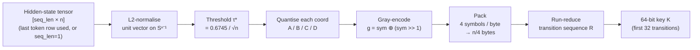
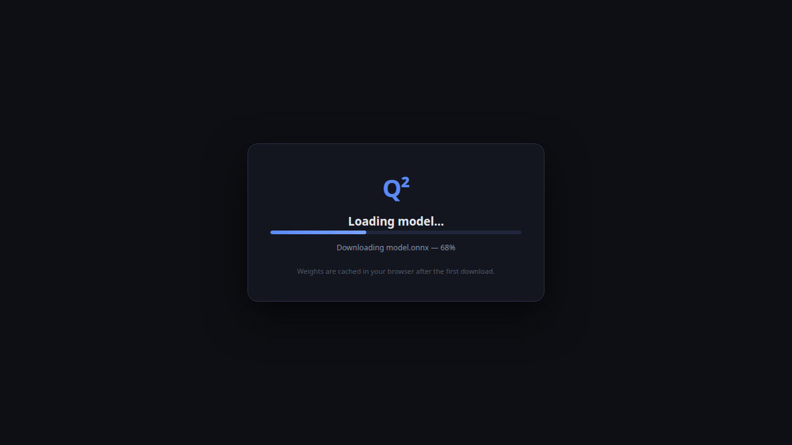
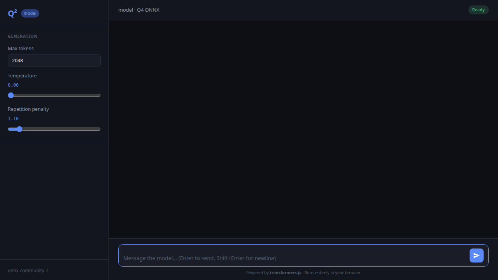
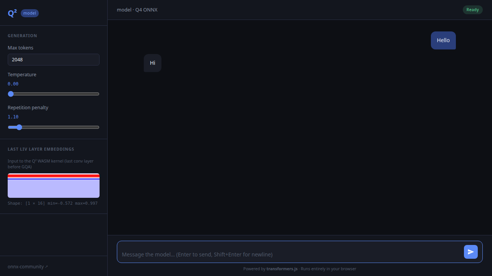

# q2
[](https://github.com/devlux76/q2/actions/workflows/ci.yml)

Quaternary Quantization

> **Quality gate:** this repo treats lint warnings as errors, and `bun run check` (lint + typecheck) is required for builds, tests, and CI.
> **Parameter Golf:** the approach for the OpenAI challenge is in [`docs/parameter-golf.md`](docs/parameter-golf.md).

## What it does

Q² converts a model's hidden activations into a compact, retrieval-friendly 64‑bit key:

- L2‑normalise the model's hidden-state activation at the selected token position.
- Quantise each coordinate into one of four symbols (A/B/C/D) using a fixed threshold.
- Gray‑encode and pack symbols into bytes, then run‑reduce into a transition sequence.
- Emit the first 32 transitions as a 64‑bit key, which can be searched efficiently with a Lee distance.

Q² starts with quaternary quantization of a local model's own native embeddings. This produces something of a fingerprint for the semantic geometry the model is currently evaluating.

This geometry is a product of human language itself. Therefore, we propose that mapping the geometry will produce faster and more accurate embeddings and we believe it most likely solves the incommensurability problem of vector similarity search.

## Q² Kernel

The Q² algorithm is implemented in [`src/q2.wat`](src/q2.wat) (WebAssembly Text Format) with a TypeScript wrapper and pure-TS fallback in [`src/q2.ts`](src/q2.ts). The full mathematical derivation is in [`DESIGN.md`](DESIGN.md).

### Algorithm

The WASM kernel expects a hidden-state tensor of shape `[seq_len × n]` (where `n` is the model's native hidden dimension, a power of 2, and `seq_len` is the sequence length). The current exported API always applies Q² to the **last** token's activation (row `seq_len − 1`); callers who only care about that token may pass `seq_len = 1` with just that row populated.

For the selected token, the algorithm operates on its hidden-state activation of shape `[n]`:

1. **L2-normalise** → unit vector on `Sⁿ⁻¹`
2. **Threshold** `τ* = 0.6745 / √n` (equiprobable 4-cell split for `N(0, 1/n)` activations)
3. **Quantise** each coordinate to `{A, B, C, D} = {0, 1, 2, 3}`:
   - `A` (strong−): `v[i] ≤ −τ*`
   - `B` (weak−): `−τ* < v[i] ≤ 0`
   - `C` (weak+): `0 < v[i] ≤ τ*`
   - `D` (strong+): `v[i] > τ*`
4. **Gray-encode**: `g = sym ⊕ (sym >> 1)` → `A=00, B=01, C=11, D=10`
5. **Pack** 4 symbols per byte (MSB-first) → `n/4` bytes
6. **Run-reduce** to the transition sequence; pack the first 32 transitions into a **64-bit key** (2 bits per symbol, MSB-aligned)



### Sub-fp32 element dtypes

The ONNX dtype setting controls model weight precision; the ONNX runtime (transformers.js) typically returns hidden-state activations as `fp32` regardless of weight dtype. The kernel handles all cases via the `dtype` field of `EmbeddingMsg`:

| dtype | Width | Bit-twiddling in `q2_quantise` |
|-------|-------|-------------------------------|
| `fp32` | 4 B/elem | Read directly as IEEE 754 single-precision |
| `fp16` | 2 B/elem | Sign preserved; 5-bit exponent rebiased +112 (15→127); 10-bit mantissa shifted left 13 to fill 23 bits. Denormals (exp=0) treated as ±0 (below quantisation resolution). |
| `q8`  | 1 B/elem | Signed int8 `∈ [−128, 127]` cast to f32. L2 normalisation cancels the implicit ×128 scale. |
| `q4`  | ½ B/elem | Two unsigned nibbles per byte. Even index → high nibble (`byte >> 4`); odd → low nibble (`byte & 0x0F`). Centred by `−8` → signed `∈ [−8, 7]`. L2 normalisation cancels the ×8 scale. |
| `q2`  | ¼ B/elem | Input is already packed Q² symbols from a prior pass. The `n/4` bytes are copied directly to output; normalisation, thresholding, and quantisation are bypassed and the kernel returns early. |

### Rebuilding the WASM kernel

The WASM binary embedded in `src/q2.ts` is compiled from `src/q2.wat`. To regenerate after editing the WAT source:

```bash
# Requires wat2wasm from the WABT toolkit (bun x wabt).
bun run build:wat
```

This compiles `src/q2.wat → src/q2.wasm` and updates the `WASM_B64` constant in `src/q2.ts`.

## Screenshots

### Loading screen
The app displays a progress card while downloading and caching the model weights (typically pre‑quantized to q4/q8).



### Chat interface (empty)
Once the model is ready, the full chat interface appears with the generation settings sidebar.



### Chat interface (conversation)
During and after a conversation the sidebar also shows the **Last LIV layer embeddings** panel — a heat-map of the raw activations and the Q² quantisation result (packed bytes + 64-bit transition key).



> To regenerate these screenshots, run:
>
> ```bash
> bun run generate-screenshots
> ```

## Setup

1. Install [Bun](https://bun.sh/) (required).
2. Install dependencies:

```bash
bun install
```

## Scripts

- **Build** (production bundle):

```bash
bun run build
```

- **Rebuild WAT kernel** (after editing `src/q2.wat`):

```bash
bun run build:wat
```

- **Dev** (watch mode):

```bash
bun run dev
```

- **Check** (lint + typecheck):

```bash
bun run check
```

- **Typecheck** (TypeScript):

```bash
bun run typecheck
```

- **Test** (unit tests + coverage):

```bash
bun run test
```

- **Browser tests** (runs tests in a real browser via Playwright):

```bash
bun run test:browser
```

> If Playwright browsers are not yet installed, run:
>
> ```bash
> bun x playwright install
> ```

## Pre-commit checks

This repo uses **Husky + lint-staged** to run linters on staged files before each commit. If a commit fails with a message like:

> `husky - pre-commit script failed (code 1)`

then an ESLint or Stylelint check failed (or the lint-staged configuration was invalid).

To troubleshoot locally:

```bash
bun run lint          # run all lint checks
bun x lint-staged     # run the pre-commit linters on staged files
```

Fix any reported issues (or adjust the linter rules), then re-stage and commit.

## Deploy (GitHub Pages)

This project is a static browser app (HTML + JS bundle). To host it on GitHub Pages, build the bundle and publish the `dist/` output as the Pages site.

1. **Build** (produces `dist/app.js`):

```bash
bun run build
```

> ✅ The build also copies the final site output into `gh-pages/`, so you can publish that folder directly if your Pages site is configured to use the `gh-pages` directory instead of the `gh-pages` branch.

2. **Copy the static entrypoints into `dist/`** so `index.html` can reference `dist/app.js` correctly:

```bash
cp index.html style.css dist/
```

3. **Publish `dist/` to GitHub Pages** (push to the `gh-pages` branch):

```bash
git add dist/index.html dist/style.css
git commit -m "chore: build for gh-pages"
# Push dist/ as the root of the gh-pages branch
git subtree push --prefix dist origin gh-pages
```

4. In your repo settings, enable GitHub Pages and set the source to the `gh-pages` branch (root).

### Optional: Auto deploy on push to main

This repository includes a GitHub Actions workflow (`.github/workflows/gh-pages.yml`) that automatically builds and publishes `dist/` to the `gh-pages` branch whenever you push to `main`.

### Optional local sanity check

To verify the built site loads before deploying, serve `dist/` locally with a static server (this is just for local testing):

```bash
bun x serve dist
```

Then open the URL it prints (e.g. `http://localhost:3000`).
