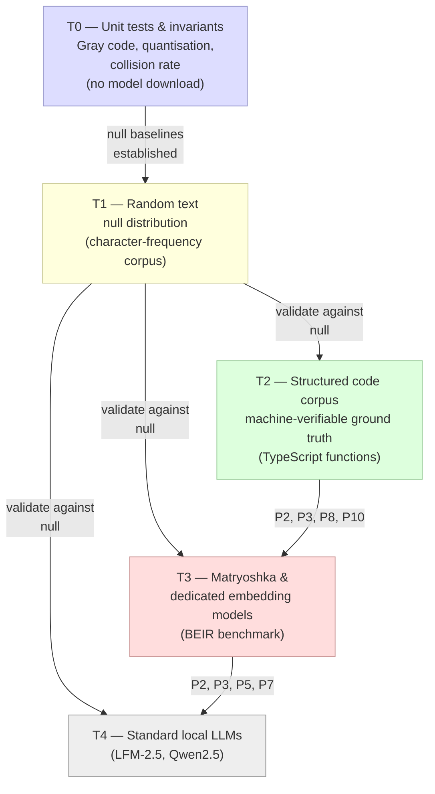

# Quaternary Quantization: Testing

> **Related documents:** [DESIGN.md](DESIGN.md) · [PREDICTIONS.md](PREDICTIONS.md)

Section references of the form §D-x.y refer to [DESIGN.md](DESIGN.md).
Section references of the form §P-x refer to [PREDICTIONS.md](PREDICTIONS.md).

---

## Contents

- [Overview](#overview)
- [T0 — Unit tests and invariants](#t0--unit-tests-and-invariants)
- [T1 — Random text null distribution](#t1--random-text-null-distribution)
- [T2 — Structured code corpus](#t2--structured-code-corpus)
- [T3 — Matryoshka and dedicated embedding models](#t3--matryoshka-and-dedicated-embedding-models)
- [T4 — Standard local LLMs](#t4--standard-local-llms)
- [Corpus layout](#corpus-layout)
- [Cross-phase prediction matrix](#cross-phase-prediction-matrix)
- [Model and corpus matrix](#model-and-corpus-matrix)

---

## Overview

Testing is organized into an initial pre-phase **T0** and four main phases **T1–T4**.
The four main phases progress from the least constrained (random text, no semantic
structure) to the most constrained (code, where ground truth is machine-verifiable)
and then broaden to measure what the encoding adds over current best-practice
embedding models.

The expected performance ordering across phases is:

$$\text{T1 (random)} \ll \text{T4 (LLM, no enc)}
< \text{T4 (LLM + enc)} \lesssim \text{T3 (matryoshka, no enc)}
\leq \text{T3 (matryoshka + enc)} \ll \text{T2 (code + enc)}$$

Each phase carries a **core retrieval benchmark** and one or more **prediction
sub-tests** tied to specific claims in [PREDICTIONS.md](PREDICTIONS.md). The
prediction sub-tests are independent of the retrieval benchmark: they can confirm
or falsify a prediction even when retrieval accuracy is at chance.

## T0 — Unit tests and invariants

These are lightweight tests that should pass locally without large corpora or
model downloads. They validate the core Q² pipeline invariants and the algebraic
properties underpinning the predictions.

- **CGAT mapping / complement involution (P1).** Verify the Gray encoding and
  complement operation ($\theta$) satisfy the required symmetry: the complement of
  each symbol is the symbol with all Gray bits flipped, and the mapping exposes the
  two chemical axes (purine/pyrimidine and keto/amino).
- **Quantisation and packing invariants.** The existing unit tests in `test/q2.test.ts`
  cover these, but add a smoke test that random normal vectors always produce a valid
  64-bit key and that the key is stable for the same input.
- **Key entropy and collision rate (P10).** A small synthetic corpus (e.g. 10k random
  embeddings) should produce a key collision rate close to the uniform baseline.

These tests are quick and form the foundation for the higher-level phases.

---

## T1 — Random text null distribution

**Purpose.** Establish the distribution of transition sequence statistics that arise
from text with no semantic structure. Deviations from the null in later phases are
only interpretable if the null is measured, not assumed.

**Model.** `Xenova/all-MiniLM-L6-v2` (or `onnx-models/all-MiniLM-L6-v2-onnx`) — a
BERT-mini encoder producing 384-dim embeddings, published specifically for
Transformers.js / ONNX Runtime. Its role here is as a "boring" baseline to confirm the
Q² pipeline introduces no embedding artifacts before real corpora are applied. It
calibrates complement bigrams, triplets, and key entropy (P3, P8, P10) on random text
and verifies that retrieval on random text performs at chance.

**Corpus.** Synthetic random text (corpus C0): characters sampled i.i.d. from the
empirical English character-frequency distribution (the 26-letter alphabet plus space
and common punctuation, weighted by standard corpus frequencies). Generate documents of
varying lengths (50, 200, 500, 2 000 characters). No LLM is involved in generation;
the embedding model serves only as a deterministic function of its input.

**Pipeline.** Apply the full Q² pipeline to each document:
1. Embed with the target model.
2. Quantize using empirically calibrated $\tau^{*}$ (§D-2.5).
3. Run-reduce to the transition sequence $R$ (§D-3.1).
4. Compute $K$ (§D-3.2), $\rho_{\text{hp}}$ (§P-2), bigram frequencies (§P-3),
   and triplet frequencies (§P-8).

**Core benchmark.** Retrieval precision on random-text corpora should be at chance
($\approx 1/C$ for a corpus of $C$ documents). Deviations indicate bias in the
encoding itself and must be diagnosed before proceeding.

**Prediction sub-tests.**

| Prediction | Measurement | Expected result |
|:----------:|:------------|:----------------|
| §P-3 | Complement-bigram frequency | $< 1/3$ if embedding model suppresses complement transitions; $\approx 1/3$ if not |
| §P-2 | $\rho_{\text{hp}}$ across document lengths | $\approx 1/9$ for all lengths (null baseline confirmation) |
| §P-8 | Triplet frequency distribution | Approximately uniform; any deviation flags an encoding artifact |

**Calibration output.** This phase produces the null distributions for $\rho_{\text{hp}}$,
complement-bigram frequency, and triplet entropy. All later-phase results are
interpreted relative to these distributions.

---

## T2 — Structured code corpus

**Purpose.** Validate the pipeline on a corpus with machine-verifiable ground truth,
using a code-specialised embedding model. Retrieval accuracy should be near-perfect;
failure here indicates a pipeline defect, not a semantic limitation.

**Models.**

- **Primary:** `sailesh27/unixcoder-base-onnx` — an ONNX export of Microsoft
  UniXcoder base, a RoBERTa-style encoder producing 768-dim code/text embeddings,
  designed for semantic code search. Well under 1B parameters.
- **Alternatives:**
  - `onnx-community/codebert-base-ONNX` — ONNX version of `microsoft/codebert-base`,
    trained on CodeSearchNet. Good classic CodeBERT baseline for code retrieval and P8
    triplet distributions.
  - `onnx-community/codebert-javascript-ONNX` — ONNX version of
    `neulab/codebert-javascript`, trained on JavaScript from
    `codeparrot/github-code-clean`. Useful for a heavily JS-oriented TypeScript corpus.
- **Generative sanity check:** `onnx-community/Qwen2.5-Coder-0.5B-Instruct` — 0.5B
  parameter coding model; verifies that code embeddings group correctly.

**Corpus.** Short, well-typed functions from a single programming language (TypeScript
recommended, consistent with the existing codebase). Source: `codeparrot/github-code-clean`,
filtered to JavaScript and TypeScript files, extracting one short standalone function
per sample. Each function is independently embeddable. Corpus size: 1 000–10 000
functions (corpus C2, ~100 MB). Ground truth is available from the AST without
annotation.

**Retrieval tasks.**
- Given a function signature, retrieve the implementation.
- Given a call site (a caller and the called function's name), retrieve the called
  function's body.

Ground truth is available from the AST without annotation.

**Core benchmark.** Retrieval accuracy at $k=1$ and $k=5$ (top-1 and top-5 recall).
Target: $> 90\%$ top-5 recall. Failure at this level indicates a defect in the Q²
pipeline.

**Prediction sub-tests.**

| Prediction | Measurement | Expected result |
|:----------:|:------------|:----------------|
| §P-2 | $\rho_{\text{hp}}$ for call-and-return functions vs. linear functions | Elevated $\rho_{\text{hp}}$ for functions that call helpers and return, relative to linear (no-call) functions of similar length |
| §P-3 | Complement-bigram frequency | $< 1/3$ if the code embedding model suppresses complement transitions |
| §P-8 | Triplet frequency distribution | Non-uniform; high-frequency triplets correspond to common code patterns (loop, branch, return) |
| §P-10 | 64-bit key collision rate | Collision rate close to the random-hash baseline; collisions should preferentially occur between semantically similar functions |

**AST ground truth for §P-2.** A function that calls one or more helpers and returns
to the caller has a call-and-return structure verifiable from the AST. No subjective
annotation is required. The prediction (elevated $\rho_{\text{hp}}$) is therefore
mechanically falsifiable.

---

## T3 — Matryoshka and dedicated embedding models

**Purpose.** Measure the contribution of quaternary encoding relative to
state-of-the-art retrieval-optimised models, including matryoshka (multi-scale
nested) embeddings. This phase also provides the strongest test of the hairpin
and antonym predictions, because the models are optimised for semantic structure.

**Models.** Three model tiers cover standard, Matryoshka, and tiny baselines:

- **Standard strong embedding (non-Matryoshka):** `mixedbread-ai/mxbai-embed-large-v1`
  — a BERT-large-class encoder, SOTA for its size on MTEB. The `onnx/` subfolder
  provides quantized weights (`model_quantized.onnx`); fully usable through
  Transformers.js feature-extraction.
- **Matryoshka models:**
  1. `nomic-ai/nomic-embed-text-v1.5` — long-context (8192-token) text encoder with
     explicit Matryoshka Representation Learning. Recommended truncation sizes: 768,
     512, 256, 128, 64. Approximately 110M parameters. Natural anchor for T3 Matryoshka
     tests.
  2. `onnx-community/embeddinggemma-300m-ONNX` — 300M-parameter embedding model
     derived from Gemma 3, producing 768-dim embeddings with Matryoshka sizes
     512/256/128 supported. Distributed as `onnx/model.onnx` with Transformers.js
     examples.
  3. `onnx-models/all-MiniLM-L6-v2-onnx` (tiny baseline) — 384-dim MiniLM, ~0.08 GB
     ONNX. Answers: "how much does Q² still help when embeddings are very small?"
- **Standard small baseline:** `Xenova/all-MiniLM-L6-v2`

**Corpus.** A standard retrieval benchmark (corpus C3, ~250–300 MB): `BeIR/beir` on
Hugging Face. Recommended tasks: MSMARCO passage, Natural Questions, FiQA, and
SciFact. Each task is subsampled to approximately 75 MB, yielding 200–300 MB total
across 3–4 tasks. Also uses a curated probe corpus for §P-2 and an antonym pair set
for §P-5 (corpus C5, ≤10 MB).

**Configurations evaluated.**

| Config | Encoding | Model |
|:------:|:--------:|:-----:|
| A | None — float cosine | Standard |
| B | Q² + uniform Lee | Standard |
| C | None — float cosine | Matryoshka |
| D | Q² + uniform Lee | Matryoshka |
| E | Q² + weighted Lee (§P-4) | Matryoshka |

**Recommended T3 configuration (configs A–E):**

- **A:** Cosine on `all-MiniLM-L6-v2` (fast baseline)
- **B:** Q² + uniform Lee on `all-MiniLM-L6-v2`
- **C:** Cosine on `nomic-embed-text-v1.5`
- **D:** Q² + uniform Lee on `nomic-embed-text-v1.5`
- **E:** Q² + weighted Lee (§P-4) on `nomic-embed-text-v1.5`

Repeat D/E with `embeddinggemma-300m-ONNX` to confirm that P2/P3/P4/P5/P7 are not
Nomic-specific behaviours.

**Core benchmark.** A standard retrieval benchmark (e.g. BEIR: MSMARCO, TREC-COVID,
NQ). Metrics: nDCG@10, Recall@100. Expected ordering: $E \geq D > C \geq B > A$.

**Prediction sub-tests.**

| Prediction | Measurement | Configurations | Expected result |
|:----------:|:------------|:--------------:|:----------------|
| §P-2 | $\rho_{\text{hp}}$ on probe corpus (Direct / Dialectical / Negated) | B, D | Dialectical $>$ Direct $\approx 1/9 >$ Negated |
| §P-3 | Complement-bigram frequency | B, D | $< 1/3$ |
| §P-4 | E vs. D retrieval | D, E | E $>$ D with statistical significance |
| §P-5 | Reverse-complement antonym retrieval on antonym pair set | B, D | Antonym retrieved at above-chance rate |
| §P-6 | Two-stage (hash + Lee) vs. flat Lee search, latency-matched | B, D | Two-stage $\geq$ flat on precision at equal latency |
| §P-7 | Secondary structure complexity vs. human rhetorical complexity annotation | B, D | Positive correlation; nested-argument documents score higher |
| §P-9 | $\mathbb{Z}_8$ vs. $\mathbb{Z}_4$ retrieval | B (Z₄), B′ (Z₈) | No significant improvement for Z₈ |
| §P-10 | 64-bit key collision rate | B, D | Collision rate close to random-hash baseline; collisions correlate with semantic similarity |

To keep the P6 measurements tractable, limit the two-stage search experiments to a
fixed prefix length (e.g. top 12–16 bits) and a manageable subset of queries, and
compare the precision/recall of the two-stage pipeline against a brute-force Lee
scan on the same candidate set.

For §P-4 (weighted Lee), estimate weights from observed bigram frequencies in the
corpus: compute empirical frequencies for transition (Ti) and transversion (Tv1/Tv2)
bigram types, then set weights proportional to the inverse frequency or log-odds
(relative to the uniform null). Evaluate a small grid around the estimated weights.

**Probe corpus for §P-2.** Construct 30–100 sentence triplets, one from each class
(Direct, Dialectical, Negated), on diverse topics. Triplets are matched by topic so
that the only varying factor is rhetorical stance. Measure $\rho_{\text{hp}}$ for each
document and test the ordering using a Wilcoxon signed-rank test (paired by topic).

**Antonym pair set for §P-5.** Curate 50–200 antonym pairs from a standard lexical
resource (WordNet). For each document in the pair, compute the reverse-complement
transition sequence, query the index, and record whether the antonym is retrieved
within the top $k$ results. Compare to a matched-difficulty non-antonym baseline.

**Annotation corpus for §P-7.** Select 50–100 documents with existing rhetorical
complexity annotations (e.g. from argumentation-mining datasets such as Persuasive
Essays (PE) or IBM Claim Stance). Compute the secondary structure of each document's
transition sequence using the Nussinov algorithm (§P-7), and measure Spearman rank
correlation between the number of nested complement pairs and the human-annotated
rhetorical complexity score.

> **Tractability note:** Nussinov is $O(n^3)$, so cap analysis at a fixed window size
> (e.g. the first 1k–2k transition symbols) or analyse a random 1k-symbol subsequence
> per document. For longer texts, a greedy heuristic (pairing the first valid complement
> in a sliding window) can provide an approximate secondary-structure score.

---

## T4 — Standard local LLMs

**Purpose.** Establish the floor contribution of Q² encoding when activations come
from a general-purpose LLM rather than a retrieval-optimised model.

**Models.** General-purpose local LLMs with accessible intermediate activations:

- **General language model:** `onnx-community/Qwen2-0.5B-Instruct-ONNX` — 0.5B
  parameter general instruction model with explicit ONNX Runtime and Transformers.js
  usage.
- **Code-centric LLM:** `onnx-community/Qwen2.5-Coder-0.5B-Instruct` — provides a
  second activation geometry tuned heavily on code.
- LFM-2.5 1.2B (Liquid AI) — available if the 1B ceiling is relaxed; not recommended
  for the first test matrix.

> **Note on LFM2.5-1.2B:** If the 1B constraint is relaxed,
> `LiquidAI/LFM2.5-1.2B-Instruct-ONNX` is an available option with 10 LIV
> (double-gated conv) blocks then 6 GQA blocks; the embedding hook uses hidden states
> from the last LIV block (layer index 9, 0-based).

**Activation source.** Final hidden-layer activations, mean-pooled over token
positions, L2-normalised. No retrieval fine-tuning.

**Corpus.** Same BEIR benchmark as T3 (corpus C3). General natural language corpus
(corpus C1, ~200 MB): `togethercomputer/RedPajama-Data-1T` sampling from books,
Wikipedia, StackExchange, and C4 slices.

**Configurations evaluated.**

| Config | Encoding | Model |
|:------:|:--------:|:-----:|
| F | None — float cosine | LLM |
| G | Q² + uniform Lee | LLM |

**Core benchmark.** Same benchmark as T3. Expected: $G > F$, but both below T3 configs
A–D (retrieval-optimised models are better retrieval models). The prediction is
that encoding raises performance from near-random toward the unencoded dedicated model
baseline.

**Prediction sub-tests.**

| Prediction | Measurement | Expected result |
|:----------:|:------------|:----------------|
| §P-2 | $\rho_{\text{hp}}$ on probe corpus | Signal present but noisier than T3; statistically significant enrichment in Dialectical class vs. null baseline ($1/9$) |
| §P-3 | Complement-bigram frequency | $< 1/3$; suppression may be weaker than in T3 |
| §P-5 | Reverse-complement antonym retrieval | Above-chance retrieval; effect size smaller than T3 |
| §P-7 | Secondary structure complexity vs. rhetorical complexity annotation | Positive correlation present but weaker than T3; statistical significance depends on model quality |

**If §P-2 sub-test fails in T4 but passes in T3:** the hairpin signal is present in
retrieval-optimised activation spaces but not in general-purpose LLM activations. This
is informative about what retrieval fine-tuning does to the structure of the L1 ball.

**If §P-2 sub-test passes in T4:** the hairpin signal is a property of the Q² encoding
applied to any sufficiently trained transformer, not an artefact of retrieval
optimisation.

---

## Corpus layout

The complete corpus stays comfortably under 1 GB of raw text, leaving headroom for
indices and probe metadata. Sizes below are design targets enforced by random
sampling.

### C0 — Synthetic random text (~0 MB)

Generated at test time from PRNG seeds; nothing stored on disk.

**Purpose:** T1 null distribution. Calibrates complement bigrams, triplets, and key
entropy for each embedding model.

**Predictions exercised:** P2, P3, P8, P10.

**How it proves/falsifies:** Confirms null baseline and complement bigram rate ≈ 1/3
for random transitions. Detects any encoding artifacts that already break P8 triplet
uniformity before real corpora are introduced.

---

### C1 — General natural language (~200 MB)

**Source:** `togethercomputer/RedPajama-Data-1T`, sampling from books, Wikipedia,
StackExchange, and C4 slices.

**Phases:** T1 (sanity vs. null), T3, T4.

**Predictions exercised:** P2, P3, P8, P10, P11, P12, P13 (monolingual side).

**How it proves/falsifies:**

- **P3:** Measures complement bigram frequency vs. the C0 null in broad real-world
  text. Underrepresentation (< 1/3) across slices supports complement suppression.
- **P2, P8:** Computes hairpin density and triplet distributions on longform documents
  vs. null; dialectical passages in StackExchange and Wikipedia discussions should show
  elevated rates.
- **P10:** Key collision rate on a 10–50k document sample.
- **P11–P13:** Provides the English/formal-writing baseline to contrast with spoken
  transcripts (C7) and cross-lingual content (C6).

---

### C2 — Structured code corpus (~100 MB)

**Source:** `codeparrot/github-code-clean`, filtered to JavaScript and TypeScript
files, extracting one short standalone function per sample. Target: 1,000–10,000
functions as specified above.

**Phases:** T2; some statistics reused in T3.

**Predictions exercised:** P2, P3, P8, P10, plus the T2 core retrieval benchmark.

**How it proves/falsifies:**

- **Core T2 retrieval:** Function-signature and call-site queries with ground truth
  from the AST validate the full Q² pipeline with code-specialized embeddings.
- **P2:** Functions are split into "call-and-return" vs. strictly linear via AST;
  elevated hairpin density in call-and-return functions relative to linear ones is
  directly falsifiable from the AST.
- **P3:** Complement bigram suppression in a domain where semantics are highly
  structured but phonology is irrelevant; if suppression still appears, that is strong
  evidence the effect is about embedding geometry, not text surface.
- **P8:** Codon-usage-like triplet frequency patterns tied to common code motifs
  (loops, branches).
- **P10:** Key entropy and collision rates in a machine-verifiable semantic domain.

---

### C3 — Retrieval benchmark subset / BEIR (~250–300 MB)

**Source:** `BeIR/beir` on Hugging Face. Recommended tasks: MSMARCO passage, Natural
Questions, FiQA, and SciFact. Each task is subsampled to approximately 75 MB of raw
text, yielding 200–300 MB total across 3–4 tasks.

**Phases:** T3, T4 (core retrieval).

**Predictions exercised:** P2–P7, P9, P10.

**How it proves/falsifies:**

- **Core T3/T4 metrics:** nDCG@10 and Recall@100 for configs A–E and F–G.
- **P4:** Uniform vs. weighted Lee comparison at equal compute; weights inferred from
  bigram statistics on C1 and C3.
- **P5:** A small curated antonym corpus can be overlaid on BEIR documents rather than
  maintained as a separate index.
- **P6:** Two-stage vs. flat Lee search on a manageable but realistically noisy
  retrieval workload.
- **P7:** BEIR contains a mix of question types and document styles, supporting
  correlation of secondary-structure scores with rhetorical complexity where
  annotations exist (e.g., SciFact rationales).

---

### C4 — Rhetorical complexity / argumentation essays (~50 MB)

**Source:** Feedback Prize – Persuasive Essays (PERSUADE corpus). Target: a few
thousand essays.

**Phases:** T3, T4.

**Predictions exercised:** P2, P7 (primary), P13 (partial).

**How it proves/falsifies:**

- **P7:** Existing argumentative element and discourse annotations serve as a proxy for
  rhetorical complexity. Nussinov-style secondary structure is computed over Q²
  transition sequences and correlated with those complexity labels.
- **P2:** Dialectical, direct, and negated argumentative moves frequently co-occur in
  the same essay sets, enabling probe triplets for the hairpin ordering test.
- **P13:** A small number of calibration triplets can be embedded here as short poems
  or essays.

---

### C5 — Antonym documents corpus (≤10 MB)

**Source:** Curated. Build 50–200 antonym pairs (e.g., optimism/pessimism,
ascent/descent, expansion/contraction) using WordNet or similar, each paired with a
1–3 paragraph explanatory text.

**Phases:** T3, T4.

**Predictions exercised:** P2 (dialectical vs. negated forms), P5 (reverse-complement
retrieval), P13 (negative regime scores for antonym pairs).

**How it proves/falsifies:**

- **P5:** Directly measures how often reverse-complement queries retrieve the antonym
  document compared to unrelated documents at the same Lee distance.
- **P2:** Direct, dialectical, and negated formulations are designed per antonym
  concept to stress-test the hairpin density ordering.

---

### C6 — Cross-lingual matched-content corpus (~75–100 MB)

**Source:** `GEM/wiki_lingua` for multi-language aligned how-to articles, or aligned
Wikipedia article sets across languages. Target: balanced across 3–5 language pairs.

**Phases:** T3, T4 (multilingual extension).

**Predictions exercised:** P11, P12, P13.

**How it proves/falsifies:**

- **P11:** Compares complement suppression rates and bigram distributions across
  typologically different languages, controlling for content via aligned articles.
- **P12:** Cross-lingual matched articles describing the same physical or structural
  reality are used as conceptual near-neighbor pairs.
- **P13:** Computes regime scores for cross-lingual pairs vs. monolingual ones.

---

### C7 — Spoken vs. written language corpus (~50 MB)

**Source:** Any open ASR transcript corpus hosted on Hugging Face (TED Talks,
conversational speech, etc.), contrasted against C1 and C3 written text.

**Phases:** T3, T4.

**Predictions exercised:** P11, P12.

**How it proves/falsifies:**

- **P11:** Compares complement-bigram suppression strength in spoken transcripts vs.
  formal writing. Stronger suppression in spoken text supports the articulatory
  grounding story.
- **P12:** Checks whether suppression rates cluster by phonotactic strictness vs.
  conceptual content across languages.

---

### Size budget summary

| Segment   | Description                                  | Target size     |
|-----------|----------------------------------------------|-----------------|
| C0        | Synthetic random text                        | ~0 MB           |
| C1        | General natural language (RedPajama)         | ~200 MB         |
| C2        | Structured code corpus (JS / TS)             | ~100 MB         |
| C3        | Retrieval benchmark subset (BEIR)            | ~250–300 MB     |
| C4        | Rhetorical complexity / argumentation essays | ~50 MB          |
| C5        | Antonym documents corpus                     | ≤10 MB          |
| C6        | Cross-lingual matched-content corpus         | ~75–100 MB      |
| C7        | Spoken vs. written language corpus           | ~50 MB          |
| **Total** |                                              | **~735–810 MB** |

This leaves comfortable headroom for indices and probe corpora within the 1 GB budget.

---

## Cross-phase prediction matrix

| Prediction | T1 | T2 | T3 | T4 |
|:----------:|:--:|:--:|:--:|:--:|
| §P-2 Hairpin density ordering | Null baseline | Hairpin in call-and-return code | Full probe corpus test | Noisy probe test |
| §P-3 CpG suppression | Null baseline | Confirm or falsify | Confirm at scale | Partial test |
| §P-4 Weighted Lee | — | — | Full benchmark | — |
| §P-5 Reverse complement = antonym | — | — | Full antonym test | Partial test |
| §P-6 Two-stage search | — | — | Latency-matched benchmark | — |
| §P-7 Secondary structure | — | — | Correlation with annotation | Correlation (noisier) |
| §P-8 Codon usage bias | Null distribution | Domain-specific biases | Multi-domain comparison | — |
| §P-9 Z₈ optimality | — | — | Z₄ vs. Z₈ benchmark | — |
| §P-10 Key collision rate | — | Collision-rate benchmark | Collision-rate benchmark | — |

Tests in the T1 column establish baseline distributions. A prediction is
**confirmed** when the T3 or T4 result is statistically significant relative to the
T1 null. A prediction is **falsified** when the result is not distinguishable from
the null at the 95% confidence level across at least two model/corpus combinations.

---

## Model and corpus matrix

| Prediction | Primary corpora | Primary models |
|:-----------|:----------------|:---------------|
| P2 (hairpin density) | C0 (null), C2 (code), C1/C3/C4 (probes) | All — MiniLM (null), UniXcoder (T2), Nomic / EmbeddingGemma (T3/T4) |
| P3 (complement suppression) | C0 (null), C1, C2, C3, C7 | All embedding models; spoken vs. written comparison via C7 |
| P4 (weighted Lee) | C1 + C3 | Nomic, EmbeddingGemma |
| P5 (reverse-complement antonyms) | C5 (primary), C3 (secondary) | Nomic, EmbeddingGemma (T3); Qwen2 activations (T4) |
| P6 (two-stage hash + Lee search) | C3 | Nomic, EmbeddingGemma with Q² keys |
| P7 (secondary structure) | C4 (primary), C1 (longform) | Nomic, EmbeddingGemma |
| P8 (codon usage bias) | C0, C1, C2 | MiniLM, Nomic, EmbeddingGemma, UniXcoder |
| P9 (Z₄ vs. Z₈) | C1 + C3 | Nomic or EmbeddingGemma with Q² vs. Z₈ variant |
| P10 (key entropy / collisions) | C2 (code), C1/C3 (NL) | All models |
| P11–P13 (regime, grounding, cross-lingual) | C1 vs. C7, C6 | Nomic, EmbeddingGemma, MiniLM, Qwen2 activations |

A concrete model matrix with rows corresponding to
`{MiniLM, Nomic, EmbeddingGemma, mxbai, UniXcoder, Qwen2, Qwen2.5-Coder}` and columns
corresponding to `{T1–T4, P2–P13}` clarifies exactly which model–phase combinations
need to be run vs. which can be pruned for an MVP.
